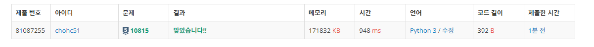
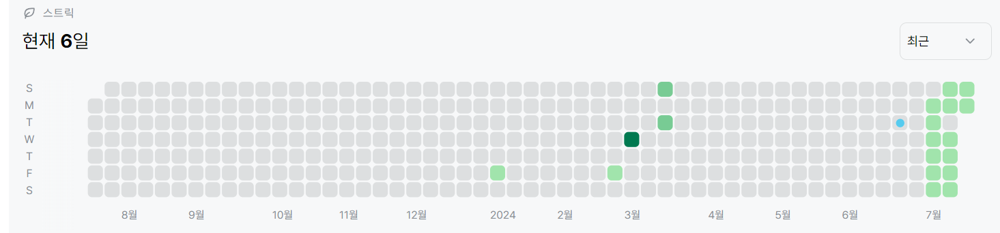

# 10815번: 숫자 카드(실버 5)
|:-----:|:------:|
| 시간 제한 | 메모리 제한 |
|  2초   | 256MB  |

## 문제
숫자 카드는 정수 하나가 적혀져 있는 카드이다. 상근이는 숫자 카드 N개를 가지고 있다. 정수 M개가 주어졌을 때, 이 수가 적혀있는 숫자 카드를 상근이가 가지고 있는지 아닌지를 구하는 프로그램을 작성하시오.
## 입력
첫째 줄에 상근이가 가지고 있는 숫자 카드의 개수 N(1 ≤ N ≤ 500,000)이 주어진다. 둘째 줄에는 숫자 카드에 적혀있는 정수가 주어진다. 숫자 카드에 적혀있는 수는 -10,000,000보다 크거나 같고, 10,000,000보다 작거나 같다. 두 숫자 카드에 같은 수가 적혀있는 경우는 없다.

셋째 줄에는 M(1 ≤ M ≤ 500,000)이 주어진다. 넷째 줄에는 상근이가 가지고 있는 숫자 카드인지 아닌지를 구해야 할 M개의 정수가 주어지며, 이 수는 공백으로 구분되어져 있다. 이 수도 -10,000,000보다 크거나 같고, 10,000,000보다 작거나 같다

## 출력
첫째 줄에 입력으로 주어진 M개의 수에 대해서, 각 수가 적힌 숫자 카드를 상근이가 가지고 있으면 1을, 아니면 0을 공백으로 구분해 출력한다.

## 예제 입력 1
```text
5
6 3 2 10 -10
8
10 9 -5 2 3 4 5 -10
```
## 예제 출력 1
```text
1 0 0 1 1 0 0 1
```


## 코드
```python
from sys import *
import collections
od = collections.OrderedDict()

hold_card_length = int(stdin.readline())
hold_card = map(int,stdin.readline().split())
check_card_length = int(stdin.readline())
check_card = map(int,stdin.readline().split())
for card in check_card:
    od[card] = 0
for card in hold_card:
    if card in od:
        od[card] += 1

for card in od.values():
    print(card)

        
```

## 채점 결과


## 스트릭
