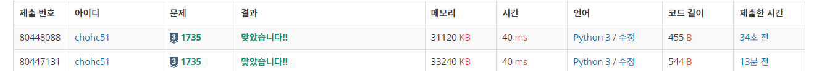
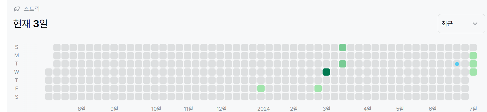

# 1735번: 분수 합(실버 3))
| 시간 제한 | 메모리 제한 |
|:-----:|:------:|
|  2초   | 128MB  |

## 문제
분수 A/B는 분자가 A, 분모가 B인 분수를 의미한다. A와 B는 모두 자연수라고 하자.
두 분수의 합 또한 분수로 표현할 수 있다. 두 분수가 주어졌을 때, 그 합을 기약분수의 형태로 구하는 프로그램을 작성하시오. 기약분수란 더 이상 약분되지 않는 분수를 의미한다.

## 입력
첫째 줄과 둘째 줄에, 각 분수의 분자와 분모를 뜻하는 두 개의 자연수가 순서대로 주어진다. 입력되는 네 자연수는 모두 30,000 이하이다.

## 출력
첫째 줄에 구하고자 하는 기약분수의 분자와 분모를 뜻하는 두 개의 자연수를 빈 칸을 사이에 두고 순서대로 출력한다.

## 예제 입력 1
```text
2 7
3 5
```
## 예제 출력 1
```text
31 35
```

## 코드
```python
#유클리드 호제법 사용
from sys import *

nume1,demo1 = map(int,stdin.readline().split())
nume2,demo2 = map(int,stdin.readline().split())

demo_result = demo1*demo2
nume_result = nume1*demo2 + demo1*nume2


def gcd(a,b): #유클리드 호제법
    while b != 0:
        a,b = b,a%b
    return a
    

while gcd(demo_result,nume_result) != 1:
     i = gcd(demo_result,nume_result)
     demo_result //= i
     nume_result //= i
    
            
print(nume_result,demo_result)

        
```

```python
#math 라이브러리 gcd 함수 사용
from sys import *
import math

nume1,demo1 = map(int,stdin.readline().split())
nume2,demo2 = map(int,stdin.readline().split())

demo_result = demo1*demo2
nume_result = nume1*demo2 + demo1*nume2

while math.gcd(demo_result,nume_result) != 1:
    i = math.gcd(demo_result,nume_result)
    demo_result //= i
    nume_result //= i
    
            
print(nume_result,demo_result)
        
```

## 채점 결과


## 스트릭
