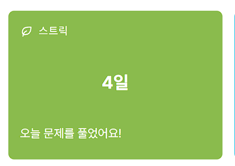

# 1075번: 나머지 (브론즈 2)

| 시간 제한 | 메모리 제한 |
| :-------: | :---------: |
|    2초    |    128MB    |

## 문제

두 정수 N과 F가 주어진다. 지민이는 정수 N의 가장 뒤 두 자리를 적절히 바꿔서 N을 F로 나누어 떨어지게 만들려고 한다. 만약 가능한 것이 여러 가지이면, 뒤 두 자리를 가능하면 작게 만들려고 한다.

예를 들어, N=275이고, F=5이면, 답은 00이다. 200이 5로 나누어 떨어지기 때문이다. N=1021이고, F=11이면, 정답은 01인데, 1001이 11로 나누어 떨어지기 때문이다.

## 입력

```
첫째 줄에 N, 둘째 줄에 F가 주어진다. N은 100보다 크거나 같고, 2,000,000,000보다 작거나 같은 자연수이다. F는 100보다 작거나 같은 자연수이다.
```

## 출력

```
첫째 줄에 마지막 두 자리를 모두 출력한다. 한자리이면 앞에 0을 추가해서 두 자리로 만들어야 한다.
```

## 코드

```
import math
def solve():
  n = int(input())
  f = int(input())

  if (n % 100 > 0):
    n = math.floor(n / 100) * 100

  while(True):
    if (n % f == 0):
      break
    n = n + 1

  if (n % 100 < 10): print('0', end='')
  print(n % 100)

solve()
```

## 채점 결과


## 스트릭 (또는 자신이 매일 문제를 풀었다는 증거)


