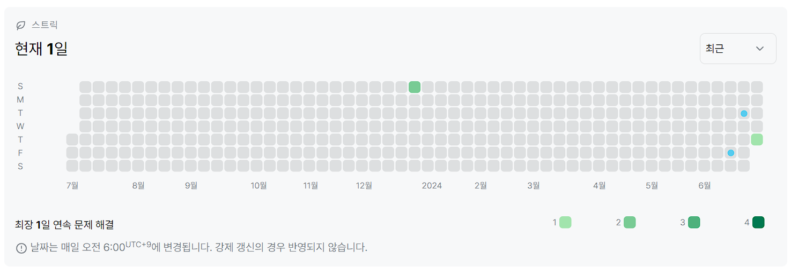

# 2557번: Hello World (브론즈 5)
|시간 제한|메모리 제한|
|:--:|:--:|
|1초|128MB|

## 문제
문자열 S를 입력받은 후에, 각 문자를 R번 반복해 새 문자열 P를 만든 후 출력하는 프로그램을 작성하시오. 즉, 첫 번째 문자를 R번 반복하고, 두 번째 문자를 R번 반복하는 식으로 P를 만들면 된다. S에는 QR Code "alphanumeric" 문자만 들어있다.

QR Code "alphanumeric" 문자는 0123456789ABCDEFGHIJKLMNOPQRSTUVWXYZ\$%*+-./: 이다.

## 입력
```
첫째 줄에 테스트 케이스의 개수 T(1 ≤ T ≤ 1,000)가 주어진다. 각 테스트 케이스는 반복 횟수 R(1 ≤ R ≤ 8), 문자열 S가 공백으로 구분되어 주어진다. S의 길이는 적어도 1이며, 20글자를 넘지 않는다. 
```

## 출력
```
각 테스트 케이스에 대해 P를 출력한다.
```
## 코드
```
def solve(R, S):
    splited = list(S)
    result = ''
    for item in splited:
        for i in range(int(R)):
            result += item
    return result

def main():
    T = int(input())
    resultList = []

    for i in range(T):
        R = input().split()
        resultList.append(solve(R[0], R[1]))

    for i in resultList:
        print(i)

main()
```

## 채점 결과


## 스트릭 (또는 자신이 매일 문제를 풀었다는 증거)
