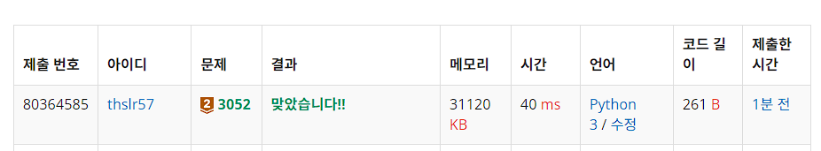

# 2557번: 나머지 (브론즈 2)
|시간 제한|메모리 제한|
|:--:|:--:|
|1초|128MB|

## 문제
두 자연수 A와 B가 있을 때, A%B는 A를 B로 나눈 나머지 이다. 예를 들어, 7, 14, 27, 38을 3으로 나눈 나머지는 1, 2, 0, 2이다. 

수 10개를 입력받은 뒤, 이를 42로 나눈 나머지를 구한다. 그 다음 서로 다른 값이 몇 개 있는지 출력하는 프로그램을 작성하시오.

## 입력
```
첫째 줄부터 열번째 줄 까지 숫자가 한 줄에 하나씩 주어진다. 이 숫자는 1,000보다 작거나 같고, 음이 아닌 정수이다.
```

## 출력
```
첫째 줄에, 42로 나누었을 때, 서로 다른 나머지가 몇 개 있는지 출력한다.
```
## 코드
```
def main(): 
  result = 0
  counts = {}

  for _ in range(10):
    nature = int(input())
    if (nature % 42 in counts):
      counts[nature % 42] += 1
    else:
      counts[nature % 42] = 1

  for _ in counts.values():
    result += 1

  print(result)

main()
```

## 채점 결과


## 스트릭 (또는 자신이 매일 문제를 풀었다는 증거)

주말에 안했더니.....