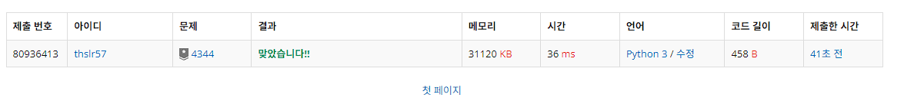
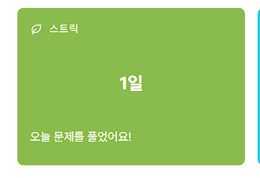

# 4344번: 평균은 하겠지.. (브론즈 1)

| 시간 제한 | 메모리 제한 |
| :-------: | :---------: |
|    2초    |    128MB    |

## 문제

대학생 새내기들의 90%는 자신이 반에서 평균은 넘는다고 생각한다. 당신은 그들에게 슬픈 진실을 알려줘야 한다.

예를 들어, N=275이고, F=5이면, 답은 00이다. 200이 5로 나누어 떨어지기 때문이다. N=1021이고, F=11이면, 정답은 01인데, 1001이 11로 나누어 떨어지기 때문이다.

## 입력

```
첫째 줄에는 테스트 케이스의 개수 C가 주어진다.

둘째 줄부터 각 테스트 케이스마다 학생의 수 N(1 ≤ N ≤ 1000, N은 정수)이 첫 수로 주어지고, 이어서 N명의 점수가 주어진다. 점수는 0보다 크거나 같고, 100보다 작거나 같은 정수이다.
```

## 출력

```
각 케이스마다 한 줄씩 평균을 넘는 학생들의 비율을 반올림하여 소수점 셋째 자리까지 출력한다. 정답과 출력값의 절대/상대 오차는 10-3이하이면 정답이다.
```

## 코드

```
def solve():
  testCase = int(input())
  reuslt = []

  for i in range(testCase):
    eachCase = list(map(int, input().split()))
    points = eachCase[1:]
    average = sum(points) / eachCase[0]
    count = 0
    for i in range(1, len(eachCase)):
      if (eachCase[i] > average):
        count += 1
    percentage = (count / eachCase[0]) * 100

    reuslt.append(percentage)

  for i in reuslt:
    formatted = f"{i:.3f}%"
    print(formatted)


solve()
```

## 채점 결과



## 스트릭 (또는 자신이 매일 문제를 풀었다는 증거)


어제 리트코드 풀었어요
