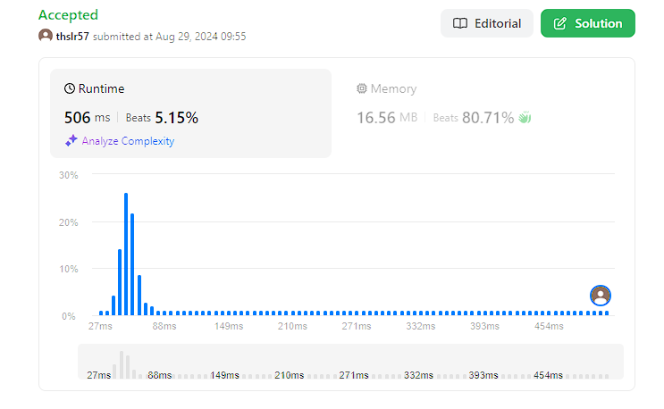

# Longest Substring Without Repeating Characters

## 문제
Given a string s, find the length of the longest substring without repeating characters.

## 입력
```
s = "abcabcbb"
```

## 출력
```
3
```

## 코드
```
class Solution:
class Solution:
    def lengthOfLongestSubstring(self, s: str) -> int:
        if len(s) == 0: return 0
        result = 0

        for i in range(len(s)):
            seen = set()
            progress = 0
            for j in range(i, len(s)):
                if s[j] in seen:
                    break
                seen.add(s[j])
                progress += 1
                result = max(result, progress)

        return result
```

## 채점 결과


