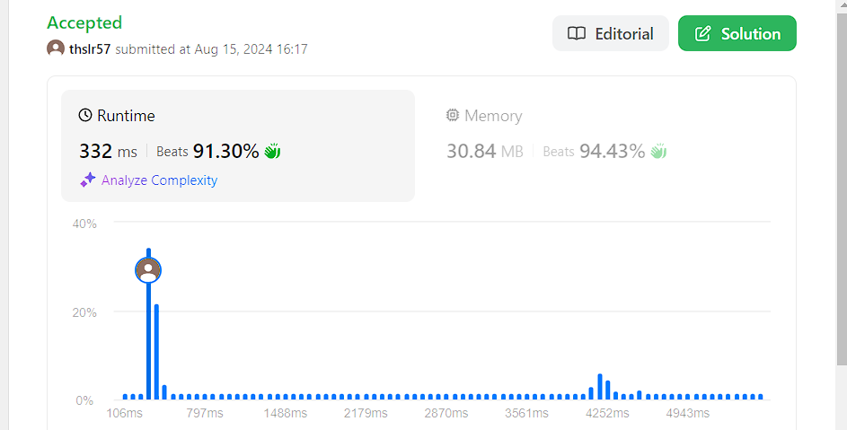

# Longest Consecutive Sequence

## 문제
Given an unsorted array of integers nums, return the length of the longest consecutive elements sequence.

You must write an algorithm that runs in O(n) time.

## 입력
```
nums = [100,4,200,1,3,2]
```

## 출력
```
4
```

## 코드
```
class Solution:
    def longestConsecutive(self, nums: List[int]) -> int:
        ## 파이썬 정렬함수 n log n
        if len(nums) == 0:
            return 0
        nums.sort()
        h = 1
        result = 1
        for i in range(len(nums) - 1):
            if nums[i+1] - nums[i] == 1:
                h += 1
            elif nums[i+1] - nums[i] == 0:
                continue
            else:
                result = max(h, result)
                h = 1
        result = max(h, result)
        return result
```

## 채점 결과


## 스트릭 (또는 자신이 매일 문제를 풀었다는 증거)
