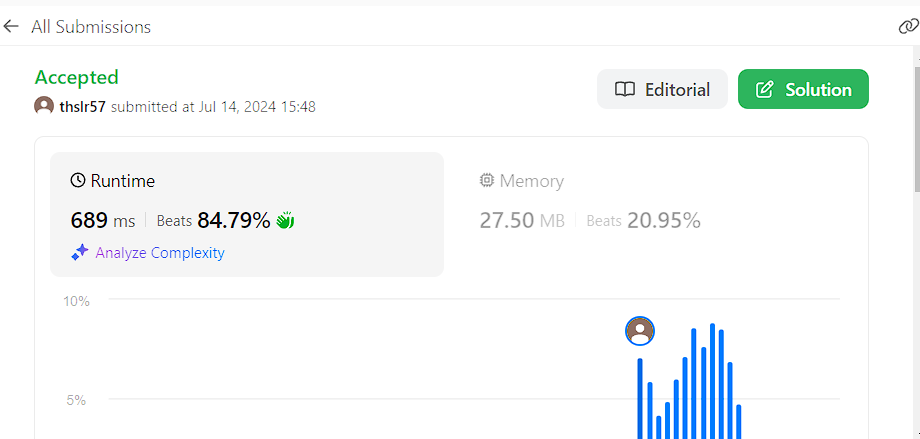

# Two Sum

## 문제
You are given an array prices where prices[i] is the price of a given stock on the ith day.

You want to maximize your profit by choosing a single day to buy one stock and choosing a different day in the future to sell that stock.

Return the maximum profit you can achieve from this transaction. If you cannot achieve any profit, return 0.
## 입력
```
prices = [7,1,5,3,6,4]
```

## 출력
```
5
Buy on day 2 (price = 1) and sell on day 5 (price = 6), profit = 6-1 = 5.
Note that buying on day 2 and selling on day 1 is not allowed because you must buy before you sell.
```
## 코드
```
class Solution:
    def maxProfit(self, prices: List[int]) -> int:
        buy, sell, maxProfit = 0, 0, 0
        buy = prices[0]
        for i in range(1, len(prices)):
            if (buy < prices[i]):
                sell = prices[i]
                if (sell - buy > maxProfit): maxProfit = sell - buy
            if (buy > prices[i]): buy = prices[i]
        
        if (maxProfit > 0): return maxProfit
        else: return 0
```

## 채점 결과


## 스트릭 (또는 자신이 매일 문제를 풀었다는 증거)
leetcode 입니다