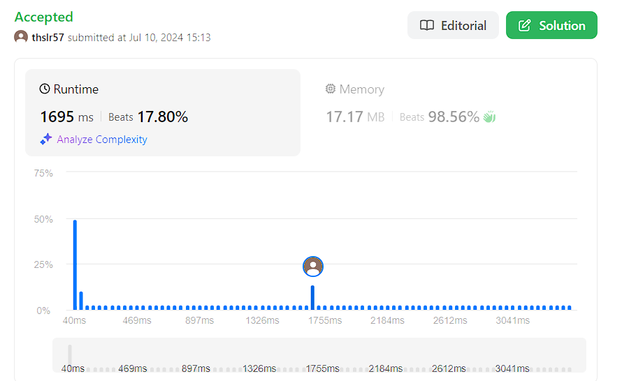

# Two Sum

## 문제
Given an array of integers nums and an integer target, return indices of the two numbers such that they add up to target.

You may assume that each input would have exactly one solution, and you may not use the same element twice.

You can return the answer in any order.
## 입력
```
nums = [2,7,11,15], target = 9
```

## 출력
```
[0,1]
Because nums[0] + nums[1] == 9, we return [0, 1].
```
## 코드
```
class Solution:
    def twoSum(self, nums: List[int], target: int) -> List[int]:
        result = []
        for i in range(len(nums)):
            for j in range(i + 1, len(nums)):
                if (nums[i] + nums[j] == target):
                    result.append(i)
                    result.append(j)
                    return result
        
        return result
```

## 채점 결과


## 스트릭 (또는 자신이 매일 문제를 풀었다는 증거)
leetcode 입니다