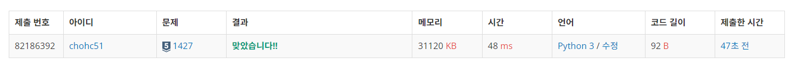
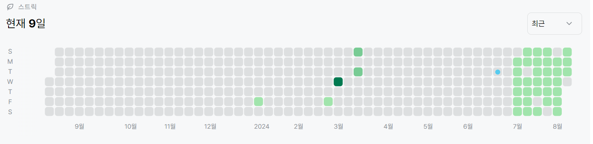

# 1427번: 소트인사이드(실버 5)
| 시간 제한 | 메모리 제한 |
|:-----:|:------:|
|  2초   | 128MB  |

## 문제
배열을 정렬하는 것은 쉽다. 수가 주어지면, 그 수의 각 자리수를 내림차순으로 정렬해보자.

## 입력
첫째 줄에 정렬하려고 하는 수 N이 주어진다. N은 1,000,000,000보다 작거나 같은 자연수이다.

## 출력
첫째 줄에 자리수를 내림차순으로 정렬한 수를 출력한다.

## 예제 입력 1
```text
2143
```
## 예제 출력 1
```text
4321
```
## 예제 입력 2
```text
999998999
```
## 예제 출력 2
```text
999999998
```

## 예제 입력 3
```text
500613009
```
## 예제 출력 3
```text
965310000
```
## 코드
```python
from sys import *

num = list((stdin.readline()))
num.sort(reverse=True)
print(*num,sep='')

```

## 채점 결과


## 스트릭
