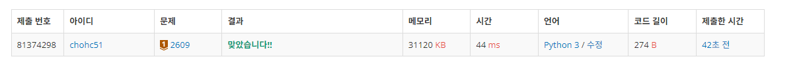
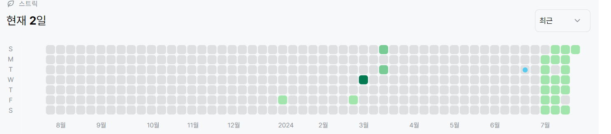

# 2609번: 최대공약수와 최소공배수(브론즈 1)
| 시간 제한 | 메모리 제한 |
|:-----:|:------:|
|  1초   | 128MB  |

## 문제
두 개의 자연수를 입력받아 최대 공약수와 최소 공배수를 출력하는 프로그램을 작성하시오.

## 입력
첫째 줄에는 두 개의 자연수가 주어진다. 이 둘은 10,000이하의 자연수이며 사이에 한 칸의 공백이 주어진다.

## 출력
첫째 줄에는 입력으로 주어진 두 수의 최대공약수를, 둘째 줄에는 입력으로 주어진 두 수의 최소 공배수를 출력한다.

## 예제 입력 1
```text
24 18
```
## 예제 출력 1
```text
6
72
```

## 코드
```python
a,b = map(int,input().split())
gcm = 1
lcm = 1

min_num = min(a,b)
max_num = max(a,b)
for i in range(min_num,0,-1):
    if max_num % i == 0 and min_num%i == 0:
        gcd = i
        break
print(gcd)

if gcd == 1:
    print(a*b)
else:
    print(int(gcd*(a/gcd)*(b/gcd)))

        
```

## 채점 결과


## 스트릭
