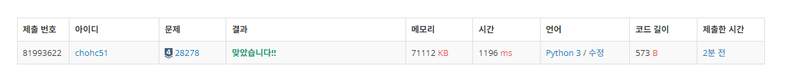
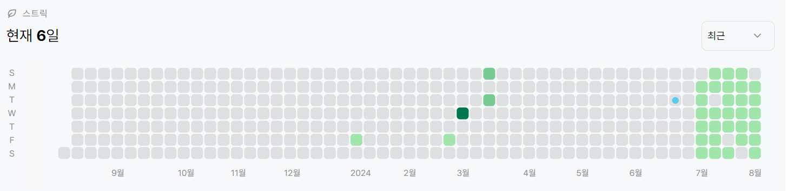

# 28278번: 스택 2(실버 4)
| 시간 제한 | 메모리 제한 |
|:-----:|:------:|
|  2초   | 1024MB  |

## 문제
정수를 저장하는 스택을 구현한 다음, 입력으로 주어지는 명령을 처리하는 프로그램을 작성하시오.

명령은 총 다섯 가지이다.

1 X: 정수 X를 스택에 넣는다. (1 ≤ X ≤ 100,000)
2: 스택에 정수가 있다면 맨 위의 정수를 빼고 출력한다. 없다면 -1을 대신 출력한다.
3: 스택에 들어있는 정수의 개수를 출력한다.
4: 스택이 비어있으면 1, 아니면 0을 출력한다.
5: 스택에 정수가 있다면 맨 위의 정수를 출력한다. 없다면 -1을 대신 출력한다.

## 입력
첫째 줄에 명령의 수 N이 주어진다. (1 ≤ N ≤ 1,000,000)

둘째 줄부터 N개 줄에 명령이 하나씩 주어진다.

출력을 요구하는 명령은 하나 이상 주어진다.

## 출력
출력을 요구하는 명령이 주어질 때마다 명령의 결과를 한 줄에 하나씩 출력한다.

## 예제 입력 1
```text
9
4
1 3
1 5
3
2
5
2
2
5
```
## 예제 출력 1
```text
1
2
5
3
3
-1
-1
```
## 코드
```python
from sys import *

num = int(stdin.readline())
stack = []
for _ in range(num):
    tmp = list(map(int,stdin.readline().split()))
    command = tmp[0]
    if command == 1:
        stack.append(tmp[1])
    elif command== 2:
        if stack:
            print(stack.pop())
        else:
            print("-1")
    elif command== 3:
        print(len(stack))
    elif command== 4:
        if not stack:
            print("1")
        else:
            print("0")
    elif command== 5:
        if stack:
            print(stack[-1])
        else:
            print("-1")
    


```

## 채점 결과


## 스트릭
