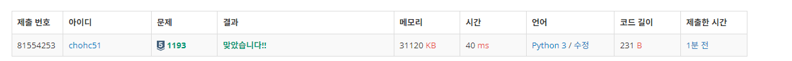
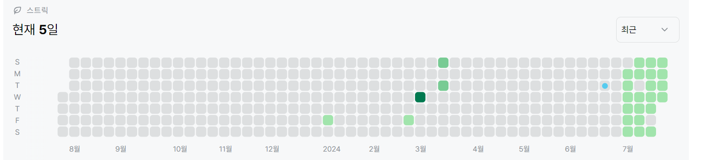

# 1193번: 분수찾기(실버 5)
| 시간 제한 | 메모리 제한 |
|:-----:|:------:|
|  0.5초   | 256MB  |

## 문제
이와 같이 나열된 분수들을 1/1 → 1/2 → 2/1 → 3/1 → 2/2 → … 과 같은 지그재그 순서로 차례대로 1번, 2번, 3번, 4번, 5번, … 분수라고 하자.

X가 주어졌을 때, X번째 분수를 구하는 프로그램을 작성하시오.

## 입력
첫째 줄에 X(1 ≤ X ≤ 10,000,000)가 주어진다.
## 출력
첫째 줄에 분수를 출력한다.

## 예제 입력 1
```text
1
```
## 예제 출력 1
```text
1/1
```

## 예제 입력 2
```text
8
```
## 예제 출력 2
```text
2/3
```
## 예제 입력 3
```text
14
```
## 예제 출력 3
```text
2/4
```
## 코드
```python
num = int(input())
i = 1
flag = False
while num-i>0:
    num -= i
    i+=1
    flag = not flag
if flag:
    y = 1 + (num-1)
    x = i - (num - 1)
else:
    y = i - (num - 1)
    x = 1 + (num-1)
print("{}/{}".format(y,x))        
```

## 채점 결과


## 스트릭
