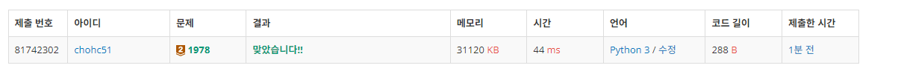
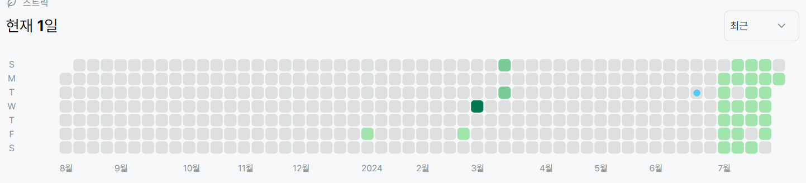

# 1978번: 소수 찾기(브론즈 2)
| 시간 제한 | 메모리 제한 |
|:-----:|:------:|
|  2초   | 128MB  |

## 문제
주어진 수 N개 중에서 소수가 몇 개인지 찾아서 출력하는 프로그램을 작성하시오.

## 입력
첫 줄에 수의 개수 N이 주어진다. N은 100이하이다. 다음으로 N개의 수가 주어지는데 수는 1,000 이하의 자연수이다.

## 출력
주어진 수들 중 소수의 개수를 출력한다.

## 예제 입력 1
```text
4
1 3 5 7
```
## 예제 출력 1
```text
3
```
## 코드
```python
from sys import *

num = int(stdin.readline())
arr= list(map(int,stdin.readline().split()))
count = 0
for i in arr:
    flag = False
    if i == 1:
        flag = True
    for x in range(2,i):
        if i % x == 0:
            flag = True
    if not flag:
        count+=1
print(count)

    
```

## 채점 결과


## 스트릭
