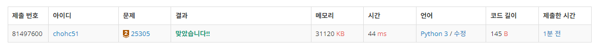
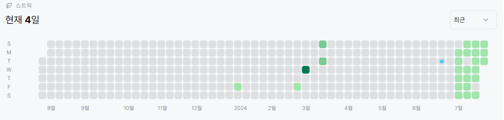

# 25305번: 커트라인(브론즈 2)
| 시간 제한 | 메모리 제한 |
|:-----:|:------:|
|  1초   | 1024MB  |

## 문제
2022 연세대학교 미래캠퍼스 슬기로운 코딩생활에 N명의 학생들이 응시했다.

이들 중 점수가 가장 높은 k명은 상을 받을 것이다. 이 때, 상을 받는 커트라인이 몇 점인지 구하라.

커트라인이란 상을 받는 사람들 중 점수가 가장 가장 낮은 사람의 점수를 말한다.

## 입력
첫째 줄에는 응시자의 수 N과 상을 받는 사람의 수 k가 공백을 사이에 두고 주어진다.

둘째 줄에는 각 학생의 점수 x가 공백을 사이에 두고 주어진다.

## 출력
상을 받는 커트라인을 출력하라.

## 예제 입력 1
```text
5 2
100 76 85 93 98
```
## 예제 출력 1
```text
98
```

## 코드
```python
from sys import *

n,m = map(int,stdin.readline().split())
arr = list(map(int,stdin.readline().split()))

arr.sort(reverse=True)
print(arr[m-1])


        
```

## 채점 결과


## 스트릭
