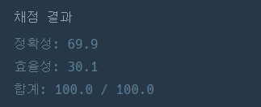

# 게임 맵 최단거리

## 문제
ROR 게임은 두 팀으로 나누어서 진행하며, 상대 팀 진영을 먼저 파괴하면 이기는 게임입니다. 따라서, 각 팀은 상대 팀 진영에 최대한 빨리 도착하는 것이 유리합니다.

지금부터 당신은 한 팀의 팀원이 되어 게임을 진행하려고 합니다. 다음은 5 x 5 크기의 맵에, 당신의 캐릭터가 (행: 1, 열: 1) 위치에 있고, 상대 팀 진영은 (행: 5, 열: 5) 위치에 있는 경우의 예시입니다.


위 그림에서 검은색 부분은 벽으로 막혀있어 갈 수 없는 길이며, 흰색 부분은 갈 수 있는 길입니다. 캐릭터가 움직일 때는 동, 서, 남, 북 방향으로 한 칸씩 이동하며, 게임 맵을 벗어난 길은 갈 수 없습니다.
아래 예시는 캐릭터가 상대 팀 진영으로 가는 두 가지 방법을 나타내고 있습니다.

첫 번째 방법은 11개의 칸을 지나서 상대 팀 진영에 도착했습니다.

두 번째 방법은 15개의 칸을 지나서 상대팀 진영에 도착했습니다.

위 예시에서는 첫 번째 방법보다 더 빠르게 상대팀 진영에 도착하는 방법은 없으므로, 이 방법이 상대 팀 진영으로 가는 가장 빠른 방법입니다.

만약, 상대 팀이 자신의 팀 진영 주위에 벽을 세워두었다면 상대 팀 진영에 도착하지 못할 수도 있습니다. 예를 들어, 다음과 같은 경우에 당신의 캐릭터는 상대 팀 진영에 도착할 수 없습니다.


게임 맵의 상태 maps가 매개변수로 주어질 때, 캐릭터가 상대 팀 진영에 도착하기 위해서 지나가야 하는 칸의 개수의 최솟값을 return 하도록 solution 함수를 완성해주세요. 단, 상대 팀 진영에 도착할 수 없을 때는 -1을 return 해주세요.
## 입출력 예
[[1,0,1,1,1],[1,0,1,0,1],[1,0,1,1,1],[1,1,1,0,1],[0,0,0,0,1]]	11
[[1,0,1,1,1],[1,0,1,0,1],[1,0,1,1,1],[1,1,1,0,0],[0,0,0,0,1]]	-1
## 코드
```python
def solution(n, times):
from collections import deque
def solution(maps):
    n = len(maps) #y축
    m = len(maps[0]) #x축
    visited = [[False]*m for _ in range(n)]
    queue = deque()
    dx = [-1,1,0,0] #위,아래,왼쪽,오른쪽
    dy = [0,0,-1,1]
    visited[0][0] = True
    queue.append((0,0)) #(y,x축)
    
    while queue:
        y,x = queue.popleft()
        for i in range(4):
            nx = x+dx[i]
            ny = y+dy[i]
            if nx<0 or ny<0 or nx>=m or ny>=n or maps[ny][nx] == 0:
                continue
            if not visited[ny][nx]:
                maps[ny][nx]= maps[y][x]+1
                visited[ny][nx] = 1
                queue.append((ny,nx))
    if maps[n-1][m-1] == 1:
        return -1
    else:
        return maps[n-1][m-1]
                


    
```
## 풀이 방법
bfs로 풀었다! 근데 n,m과 x,y의 배열위치를 자꾸 실수해서 아쉬었다.


## 채점 결과
