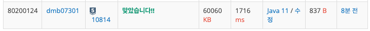
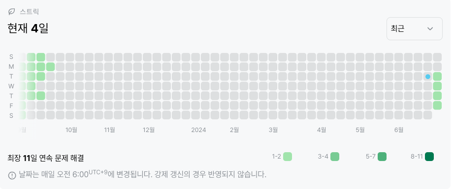

# 10814: 나이순 정렬 (실버 5)
|시간 제한|메모리 제한|
|:--:|:--:|
|1초|128MB|

## 문제
나이순 정렬

## 문제 설명
온라인 저지에 가입한 사람들의 나이와 이름이 가입한 순서대로 주어진다. 이때, 회원들을 나이가 증가하는 순으로, 나이가 같으면 먼저 가입한 사람이 앞에 오는 순서로 정렬하는 프로그램을 작성하시오.


## 입력
```
3
21 Junkyu
21 Dohyun
20 Sunyoung
```

## 출력
```
20 Sunyoung
21 Junkyu
21 Dohyun
```
## 코드
```java
import java.io.BufferedReader;
import java.io.IOException;
import java.io.InputStreamReader;
import java.util.Arrays;
import java.util.StringTokenizer;

public class Main {
    public static void main(String[] args) throws IOException {
        BufferedReader br = new BufferedReader(new InputStreamReader(System.in));
        StringTokenizer st;

        int N = Integer.parseInt(br.readLine());
        String[][] arr = new String[N][2];

        for(int i = 0; i < N; i++){
            st = new StringTokenizer(br.readLine());

            arr[i][0] = st.nextToken();
            arr[i][1] = st.nextToken();
        }

        Arrays.sort(arr, (s1, s2) -> Integer.parseInt(s1[0]) - Integer.parseInt(s2[0]));

        for(int j = 0; j < N; j++) {
            System.out.println(arr[j][0] + " " + arr[j][1]);
        }
    }
}

```

## 채점 결과

## 스트릭 (또는 자신이 매일 문제를 풀었다는 증거)
