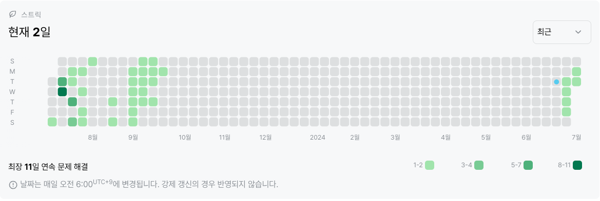

# 2164번: 카드2 (실버 4)
|시간 제한|메모리 제한|
|:--:|:--:|
|1초|128MB|

## 문제
N장의 카드가 있다. 각각의 카드는 차례로 1부터 N까지의 번호가 붙어 있으며, 1번 카드가 제일 위에, N번 카드가 제일 아래인 상태로 순서대로 카드가 놓여 있다.

이제 다음과 같은 동작을 카드가 한 장 남을 때까지 반복하게 된다. 우선, 제일 위에 있는 카드를 바닥에 버린다. 그 다음, 제일 위에 있는 카드를 제일 아래에 있는 카드 밑으로 옮긴다.

예를 들어 N=4인 경우를 생각해 보자. 카드는 제일 위에서부터 1234 의 순서로 놓여있다. 1을 버리면 234가 남는다. 여기서 2를 제일 아래로 옮기면 342가 된다. 3을 버리면 42가 되고, 4를 밑으로 옮기면 24가 된다. 마지막으로 2를 버리고 나면, 남는 카드는 4가 된다.

N이 주어졌을 때, 제일 마지막에 남게 되는 카드를 구하는 프로그램을 작성하시오.

## 문제 설명
첫째 줄에 남게 되는 카드의 번호를 출력한다.


## 입력
```
6
```

## 출력
```
4
```
## 코드
```java
import java.io.BufferedReader;
import java.io.IOException;
import java.io.InputStreamReader;
import java.util.Deque;
import java.util.LinkedList;

public class Main {
    public static void main(String[] args) throws IOException {
        BufferedReader br = new BufferedReader(new InputStreamReader(System.in));

        int N = Integer.parseInt(br.readLine());
        Deque<Integer> cards = new LinkedList<>();

        for (int i = 0; i < N; i++) {
            cards.add(i + 1);
        }

        while (cards.size() != 1) {
            cards.poll();
            cards.offerLast(cards.poll());
        }

        System.out.println(cards.peekLast());
    }
}

```

## 채점 결과


## 스트릭 (또는 자신이 매일 문제를 풀었다는 증거)
