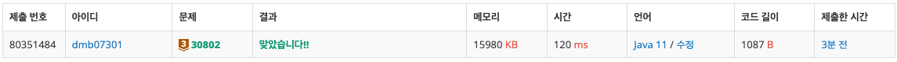
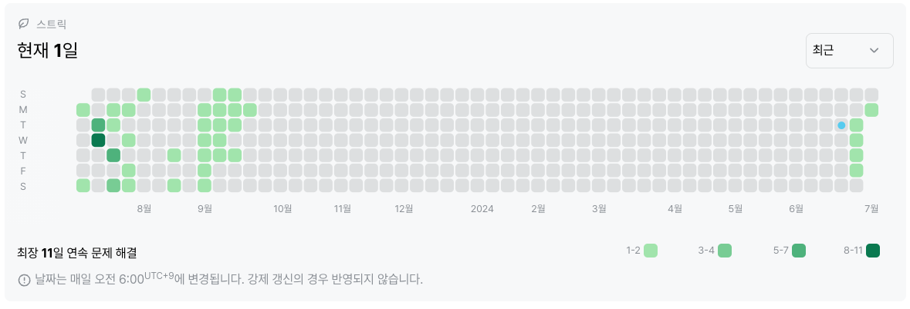

# 30802번: 웰컴 키트 (브론즈 3)
|시간 제한|메모리 제한|
|:--:|:--:|
|1초|128MB|

## 문제
2024년 2월 3일 개최 예정인 온사이트 그랜드 아레나에서는 참가자들에게 티셔츠 한 장과 펜 한 자루가 포함된 웰컴 키트를 나눠줄 예정입니다. 키트를 제작하는 업체는 다음과 같은 조건으로만 주문이 가능합니다.

티셔츠는 S, M, L, XL, XXL, 그리고 XXXL의 6가지 사이즈가 있습니다. 티셔츠는 같은 사이즈의
$T$장 묶음으로만 주문할 수 있습니다.
펜은 한 종류로,
$P$자루씩 묶음으로 주문하거나 한 자루씩 주문할 수 있습니다.
총
$N$명의 참가자 중 S, M, L, XL, XXL, XXXL 사이즈의 티셔츠를 신청한 사람은 각각
$S, M, L, XL, XXL, XXXL$명입니다. 티셔츠는 남아도 되지만 부족해서는 안 되고 신청한 사이즈대로 나눠주어야 합니다. 펜은 남거나 부족해서는 안 되고 정확히 참가자 수만큼 준비되어야 합니다.

티셔츠를
$T$장씩 최소 몇 묶음 주문해야 하는지, 그리고 펜을
$P$자루씩 최대 몇 묶음 주문할 수 있고, 그 때 펜을 한 자루씩 몇 개 주문하는지 구하세요.

## 문제 설명
경우의 수 문제


## 입력
```
23
3 1 4 1 5 9
5 7
```

## 출력
```
7
3 2
```
## 코드
```java
import java.io.BufferedReader;
import java.io.IOException;
import java.io.InputStreamReader;
import java.util.ArrayList;
import java.util.List;
import java.util.StringTokenizer;

public class Main {
    public static void main(String[] args) throws IOException {
        BufferedReader br = new BufferedReader(new InputStreamReader(System.in));
        StringTokenizer st;
        int N = Integer.parseInt(br.readLine());

        List<Integer> tShirts = new ArrayList<>();

        st = new StringTokenizer(br.readLine());
        for (int i = 0; i < 6; i++) {
            tShirts.add(Integer.parseInt(st.nextToken()));
        }

        st = new StringTokenizer(br.readLine());
        int T = Integer.parseInt(st.nextToken());
        int P = Integer.parseInt(st.nextToken());

        int sumT = 0;
        for (int j = 0; j < 6; j++) {
            int a = tShirts.get(j) / T;
            if(tShirts.get(j) % T != 0){
                a += 1;
            }

            sumT += a;
        }

        System.out.println(sumT);
        System.out.println(N / P + " " + N % P);
    }
}

```

## 채점 결과


## 스트릭 (또는 자신이 매일 문제를 풀었다는 증거)

