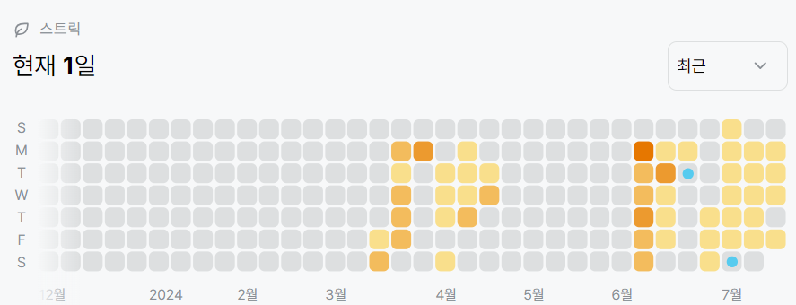

# 2206번: 벽 부수고 이동하기(골드 3)
| 시간 제한 | 메모리 제한 |
|:-----:|:------:|
|  2초   | 192MB  |

## 문제
N×M의 행렬로 표현되는 맵이 있다. 맵에서 0은 이동할 수 있는 곳을 나타내고, 1은 이동할 수 없는 벽이 있는 곳을 나타낸다. 당신은 (1, 1)에서 (N, M)의 위치까지 이동하려 하는데, 이때 최단 경로로 이동하려 한다. 최단경로는 맵에서 가장 적은 개수의 칸을 지나는 경로를 말하는데, 이때 시작하는 칸과 끝나는 칸도 포함해서 센다.

만약에 이동하는 도중에 한 개의 벽을 부수고 이동하는 것이 좀 더 경로가 짧아진다면, 벽을 한 개 까지 부수고 이동하여도 된다.

한 칸에서 이동할 수 있는 칸은 상하좌우로 인접한 칸이다.

맵이 주어졌을 때, 최단 경로를 구해 내는 프로그램을 작성하시오.

## 문제 설명
```text
1. bfs로 풀 수 있다.
2. 큐에 (x, y, dist)만 넣는 것이 아니라 possible(벽을 부술 수 있는지)도 추가하여 진행한다.
3. bfs는 시작점에서 한 번, 종료지점에서 한 번 진행한다.
4. 4방으로 이동할 때 반복문을 사용하기 때문에 의도치 않게 방향에 따른 우선순위가 생기게 된다. 따라서 시작지점에서 bfs를 먼저 시작하면 도착하지 못하는 경우가 생길 수 있기 때문에 도착지점에서 한 번 더 bfs를 진행하여 두 값중 더 작은 값을 출력한다.
```

## 입력
첫째 줄에 N(1 ≤ N ≤ 1,000), M(1 ≤ M ≤ 1,000)이 주어진다. 다음 N개의 줄에 M개의 숫자로 맵이 주어진다. (1, 1)과 (N, M)은 항상 0이라고 가정하자.

## 출력
첫째 줄에 최단 거리를 출력한다. 불가능할 때는 -1을 출력한다.


## 예제 입력 1 
```text
6 4
0100
1110
1000
0000
0111
0000
```
## 예제 출력 1 
```text
15
```

## 예제 입력 2 
```text
4 4
0111
1111
1111
1110
```
## 예제 출력 2 
```text
-1
```

## 코드
```python
from collections import deque
import sys
input = sys.stdin.readline

N, M = map(int, input().rstrip().split())
grid = [list(map(int, list(input().rstrip()))) for _ in range(N)]

def bfs(x, y, ex, ey):
    visited = [[False for _ in range(M)] for _ in range(N)]
    visited[x][y] = True

    q = deque([(x, y, True, 1)])

    while q:
        x, y, possible, cnt = q.popleft()
        if x == ex and y == ey:
            return cnt

        for dx, dy in [(0, 1), (0, -1), (1, 0), (-1, 0)]:
            nx, ny = x + dx, y + dy
            if 0 <= nx < N and 0 <= ny < M:
                if not visited[nx][ny]:
                    if grid[nx][ny] == 1:
                        if possible:
                            visited[nx][ny] = True
                            q.append((nx, ny, False, cnt + 1))
                    else:
                        visited[nx][ny] = True
                        q.append((nx, ny, possible, cnt + 1))

res1 = bfs(0, 0, N - 1, M - 1)
res2 = bfs(N - 1, M - 1, 0, 0)

if res1 is None and res2 is not None:
    print(res2)
elif res1 is not None and res2 is None:
    print(res1)
elif res1 is None and res2 is None:
    print(-1)
else:
    print(min(res1, res2))


```

## 채점 결과


## 스트릭
