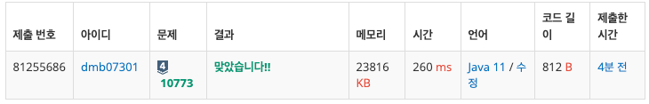
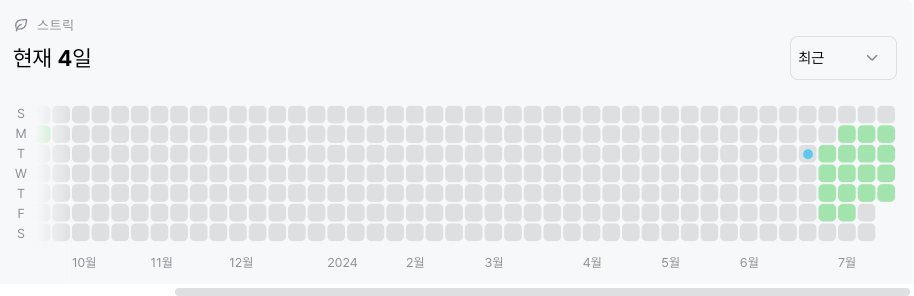

# 10773번: 제로 (실버 4)
|시간 제한|메모리 제한|
|:--:|:--:|
|1초|128MB|

## 문제
나코더 기장 재민이는 동아리 회식을 준비하기 위해서 장부를 관리하는 중이다.
재현이는 재민이를 도와서 돈을 관리하는 중인데, 애석하게도 항상 정신없는 재현이는 돈을 실수로 잘못 부르는 사고를 치기 일쑤였다.
재현이는 잘못된 수를 부를 때마다 0을 외쳐서, 가장 최근에 재민이가 쓴 수를 지우게 시킨다.
재민이는 이렇게 모든 수를 받아 적은 후 그 수의 합을 알고 싶어 한다. 재민이를 도와주자!
## 문제 설명
첫 번째 줄에 정수 K가 주어진다. (1 ≤ K ≤ 100,000)
이후 K개의 줄에 정수가 1개씩 주어진다. 정수는 0에서 1,000,000 사이의 값을 가지며, 정수가 "0" 일 경우에는 가장 최근에 쓴 수를 지우고, 아닐 경우 해당 수를 쓴다.
정수가 "0"일 경우에 지울 수 있는 수가 있음을 보장할 수 있다.

재민이가 최종적으로 적어 낸 수의 합을 출력한다. 최종적으로 적어낸 수의 합은 231-1보다 작거나 같은 정수이다.
## 입력
```
10
1
3
5
4
0
0
7
0
0
6
```

## 출력
```
7
```
## 코드
```java
import java.io.BufferedReader;
import java.io.IOException;
import java.io.InputStreamReader;
import java.util.Stack;

public class Main {
    public static void main(String[] args) throws IOException {
        BufferedReader br = new BufferedReader(new InputStreamReader(System.in));
        int k = Integer.parseInt(br.readLine());
        int input;
        int total = 0;

        Stack<Integer> stack = new Stack<>();

        for (int i = 0; i < k; i++) {
            input = Integer.parseInt(br.readLine());
            if (input == 0) {
                stack.pop();
            } else {
                stack.push(input);
            }
        }

        int h = stack.size();

        for (int j = 0; j < h; j++) {
            total += stack.pop();
        }

        System.out.println(total);
    }
}

```

## 채점 결과

## 스트릭 (또는 자신이 매일 문제를 풀었다는 증거)
