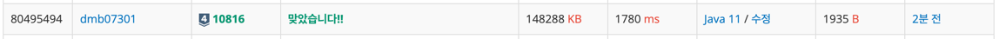
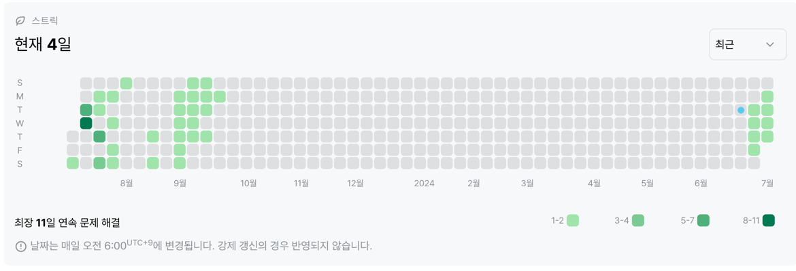

# 10816번: 숫자카드2 (실버 4)
|시간 제한|메모리 제한|
|:--:|:--:|
|1초|128MB|

## 문제
숫자 카드는 정수 하나가 적혀져 있는 카드이다. 상근이는 숫자 카드 N개를 가지고 있다. 정수 M개가 주어졌을 때, 이 수가 적혀있는 숫자 카드를 상근이가 몇 개 가지고 있는지 구하는 프로그램을 작성하시오.

## 문제 설명
첫째 줄에 상근이가 가지고 있는 숫자 카드의 개수 N(1 ≤ N ≤ 500,000)이 주어진다. 둘째 줄에는 숫자 카드에 적혀있는 정수가 주어진다. 숫자 카드에 적혀있는 수는 -10,000,000보다 크거나 같고, 10,000,000보다 작거나 같다.
셋째 줄에는 M(1 ≤ M ≤ 500,000)이 주어진다. 넷째 줄에는 상근이가 몇 개 가지고 있는 숫자 카드인지 구해야 할 M개의 정수가 주어지며, 이 수는 공백으로 구분되어져 있다. 이 수도 -10,000,000보다 크거나 같고, 10,000,000보다 작거나 같다.

첫째 줄에 입력으로 주어진 M개의 수에 대해서, 각 수가 적힌 숫자 카드를 상근이가 몇 개 가지고 있는지를 공백으로 구분해 출력한다.

## 입력
```
10
6 3 2 10 10 10 -10 -10 7 3
8
10 9 -5 2 3 4 5 -10
```

## 출력
```
3 0 0 1 2 0 0 2
```
## 코드
```java
import java.io.BufferedReader;
import java.io.IOException;
import java.io.InputStreamReader;
import java.util.ArrayList;
import java.util.Collections;
import java.util.List;
import java.util.StringTokenizer;

public class Main {
    private static List<Integer> sgArr = new ArrayList<>();

    public static void main(String[] args) throws IOException {
        BufferedReader br = new BufferedReader(new InputStreamReader(System.in));
        StringTokenizer st;
        StringBuilder sb = new StringBuilder();

        int N = Integer.parseInt(br.readLine());

        st = new StringTokenizer(br.readLine());
        for (int i = 0; i < N; i++) {
            sgArr.add(Integer.parseInt(st.nextToken()));
        }

        Collections.sort(sgArr);

        List<Integer> mArr = new ArrayList<>();
        int M = Integer.parseInt(br.readLine());
        st = new StringTokenizer(br.readLine());
        for (int k = 0; k < M; k++) {
            mArr.add(Integer.parseInt(st.nextToken()));
        }

        for (int j = 0; j < M; j++) {
            int low = findFirst(mArr.get(j));
            int high = findLast(mArr.get(j));
            sb.append(high - low).append(" ");
        }
        System.out.println(sb);
    }

    public static int findFirst(int key) {
        int low = 0;
        int high = sgArr.size();
        int mid;

        while (low < high) {
            mid = (low + high) / 2;

            if (sgArr.get(mid) >= key) {
                high = mid;
            } else {
                low = mid + 1;
            }
        }
        return low;
    }

    public static int findLast(int key) {
        int low = 0;
        int high = sgArr.size();
        int mid;

        while (low < high) {
            mid = (low + high) / 2;

            if (key < sgArr.get(mid)) {
                high = mid;
            } else {
                low = mid + 1;
            }
        }
        return low;
    }
}

```

## 채점 결과


## 스트릭 (또는 자신이 매일 문제를 풀었다는 증거)
