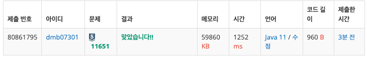
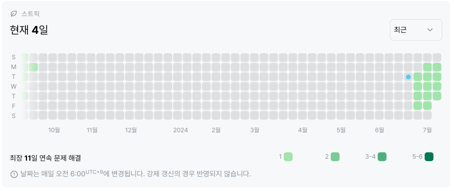

# 11651번: 좌표 정렬하기 2(실버 5)
|시간 제한|메모리 제한|
|:--:|:--:|
|1초|128MB|

## 문제
2차원 평면 위의 점 N개가 주어진다. 좌표를 y좌표가 증가하는 순으로, y좌표가 같으면 x좌표가 증가하는 순서로 정렬한 다음 출력하는 프로그램을 작성하시오.

## 문제 설명
첫째 줄에 점의 개수 N (1 ≤ N ≤ 100,000)이 주어진다. 둘째 줄부터 N개의 줄에는 i번점의 위치 xi와 yi가 주어진다. (-100,000 ≤ xi, yi ≤ 100,000) 좌표는 항상 정수이고, 위치가 같은 두 점은 없다.

## 입력
```
5
0 4
1 2
1 -1
2 2
3 3
```

## 출력
```
1 -1
1 2
2 2
3 3
0 4
```
## 코드
```java
import java.io.BufferedReader;
import java.io.IOException;
import java.io.InputStreamReader;
import java.util.Arrays;
import java.util.StringTokenizer;

public class Main {
    public static void main(String[] args) throws IOException {
        BufferedReader br = new BufferedReader(new InputStreamReader(System.in));
        StringTokenizer st;

        int n = Integer.parseInt(br.readLine());
        int[][] arr = new int[n][2];

        for(int i = 0; i < n; i++){
            st = new StringTokenizer(br.readLine());
            arr[i][0] = Integer.parseInt(st.nextToken());
            arr[i][1] = Integer.parseInt(st.nextToken());
        }

        Arrays.sort(arr, (o1, o2) -> {
            if(o1[1] == o2[1]){
                return o1[0] - o2[0];
            }else{
                return o1[1] - o2[1];
            }
        });

        for(int j = 0; j < n; j++){
            System.out.println(arr[j][0] + " " + arr[j][1]);
        }
    }
}


```

## 채점 결과


## 스트릭 (또는 자신이 매일 문제를 풀었다는 증거)

