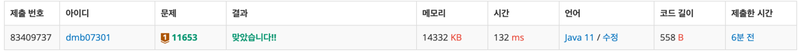

# 11653번: 소인수분해(브론즈 1)
|시간 제한|메모리 제한|
|:--:|:--:|
|1초|128MB|

## 문제
정수 N이 주어졌을 때, 소인수분해하는 프로그램을 작성하시오.

## 문제 설명
첫째 줄에 정수 N (1 ≤ N ≤ 10,000,000)이 주어진다.

N의 소인수분해 결과를 한 줄에 하나씩 오름차순으로 출력한다. N이 1인 경우 아무것도 출력하지 않는다.
## 입력
```
9991
```

## 출력
```
97
103
```
## 코드
```java
import java.io.BufferedReader;
import java.io.IOException;
import java.io.InputStreamReader;

public class Main {
    public static void main(String[] args) throws IOException {
        BufferedReader br = new BufferedReader(new InputStreamReader(System.in));
        int num = Integer.parseInt(br.readLine());
        int i = 2;

        while (true) {
            if (num == 1)
                break;

            if (num % i == 0) {
                num /= i;
                System.out.println(i);
            } else
                i++;
        }
    }
}

```

## 채점 결과

## 스트릭 (또는 자신이 매일 문제를 풀었다는 증거)
