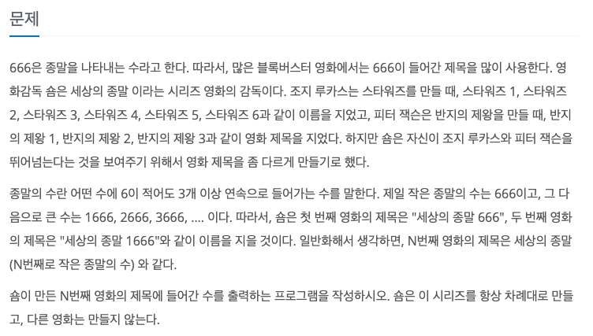
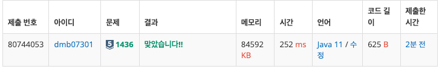
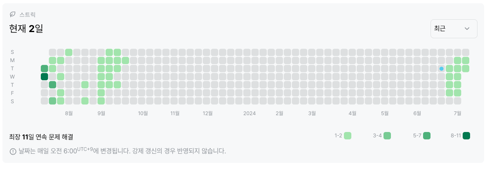

# 1436번 : 영화감독 숌 (실버 5)
|시간 제한|메모리 제한|
|:--:|:--:|
|1초|128MB|

## 문제


## 문제 설명
첫째 줄에 N이 주어진다. N은 10,000보다 작거나 같은 자연수이다.

첫째 줄에 N번째 영화의 제목에 들어간 수를 출력한다.

## 입력
```
187
```

## 출력
```
66666
```
## 코드
```java
import java.io.BufferedReader;
import java.io.IOException;
import java.io.InputStreamReader;

public class Main {
    public static void main(String[] args) throws IOException {
            BufferedReader br = new BufferedReader(new InputStreamReader(System.in));
            int N = Integer.parseInt(br.readLine());
            String str;
            int count = 0;
    
            for (int i = 0; ; i++) {
                str = Integer.toString(i);
    
                if (str.contains("666")) {
                    count++;
                }
    
                if (count == N) {
                    break;
                }
            }
    
            System.out.println(str);
    }
}

```

## 채점 결과


## 스트릭 (또는 자신이 매일 문제를 풀었다는 증거)

