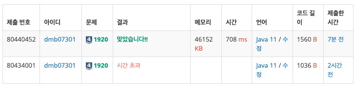
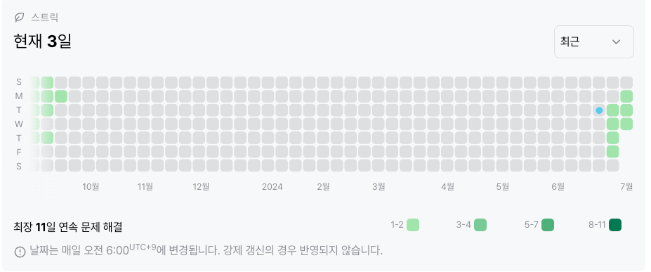

# 1920: 수 찾기 (실버 4)
|시간 제한|메모리 제한|
|:--:|:--:|
|1초|128MB|

## 문제
N개의 정수 A[1], A[2], …, A[N]이 주어져 있을 때, 이 안에 X라는 정수가 존재하는지 알아내는 프로그램을 작성하시오.

## 문제 설명
첫째 줄에 자연수 N(1 ≤ N ≤ 100,000)이 주어진다. 다음 줄에는 N개의 정수 A[1], A[2], …, A[N]이 주어진다. 다음 줄에는 M(1 ≤ M ≤ 100,000)이 주어진다. 다음 줄에는 M개의 수들이 주어지는데, 이 수들이 A안에 존재하는지 알아내면 된다. 모든 정수의 범위는 -231 보다 크거나 같고 231보다 작다.

M개의 줄에 답을 출력한다. 존재하면 1을, 존재하지 않으면 0을 출력한다.

## 입력
```
5
4 1 5 2 3
5
1 3 7 9 5
```

## 출력
```
1
1
0
0
1
```
## 코드
```java
import java.io.BufferedReader;
import java.io.IOException;
import java.io.InputStreamReader;
import java.util.ArrayList;
import java.util.Collections;
import java.util.List;
import java.util.StringTokenizer;

public class Main {
    public static void main(String[] args) throws IOException {
        BufferedReader br = new BufferedReader(new InputStreamReader(System.in));
        StringTokenizer st;
        StringBuilder sb = new StringBuilder();

        List<Integer> A = new ArrayList<>();

        int N = Integer.parseInt(br.readLine());
        st = new StringTokenizer(br.readLine());

        for (int i = 0; i < N; i++) {
            A.add(Integer.parseInt(st.nextToken()));
        }

        Collections.sort(A);

        int M = Integer.parseInt(br.readLine());
        st = new StringTokenizer(br.readLine());

        for(int j = 0; j < M; j++){
            if(binarySearch(A, Integer.parseInt(st.nextToken())) >= 0){
                sb.append(1 + "\n");
            }
            else{
                sb.append(0 + "\n");
            }
        }

        System.out.println(sb);
    }

    public static int binarySearch(List<Integer> A, int key) {
        int low = 0;
        int high = A.size() - 1;

        while (low <= high) {
            int mid = (low + high) / 2;

            if(key < A.get(mid)){
                high = mid - 1;
            } else if(key > A.get(mid)){
                low = mid + 1;
            } else {
                return mid;
            }
        }

        return -1;
    }
}

```

## 채점 결과

## 스트릭 (또는 자신이 매일 문제를 풀었다는 증거)
