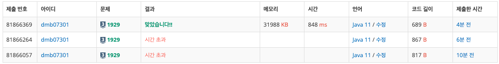
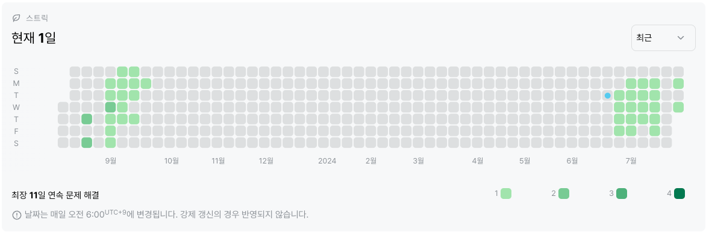

# 1929번: 소수 구하기(실버3)
|시간 제한|메모리 제한|
|:--:|:--:|
|1초|128MB|

## 문제
M이상 N이하의 소수를 모두 출력하는 프로그램을 작성하시오.


## 문제 설명
첫째 줄에 자연수 M과 N이 빈 칸을 사이에 두고 주어진다. (1 ≤ M ≤ N ≤ 1,000,000) M이상 N이하의 소수가 하나 이상 있는 입력만 주어진다.

한 줄에 하나씩, 증가하는 순서대로 소수를 출력한다.
## 입력
```
3 16
```

## 출력
```
3
5
7
11
13
```
## 코드
```java
import java.util.Scanner;

public class Main {
    public static boolean[] prime;
    public static void main(String[] args) {

        Scanner in = new Scanner(System.in);
        int M = in.nextInt();
        int N = in.nextInt();

        prime = new boolean[N + 1];
        get_prime();

        for(int i = M; i <= N; i++) {
            if(!prime[i]) System.out.println(i);
        }
    }

    public static void get_prime() {
        prime[0] = prime[1] = true;

        for(int i = 2; i <= Math.sqrt(prime.length); i++) {
            if(prime[i]) continue;
            for(int j = i * i; j < prime.length; j += i) {
                prime[j] = true;
            }
        }
    }
}
```

## 채점 결과


## 스트릭 (또는 자신이 매일 문제를 풀었다는 증거)
