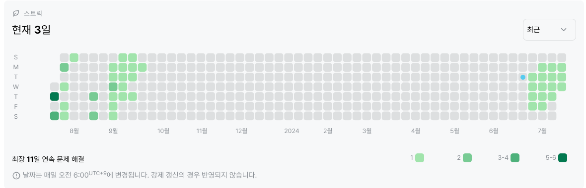

# 2839번: 설탕 배달하기(실버4)
|시간 제한|메모리 제한|
|:--:|:--:|
|1초|128MB|

## 문제
상근이는 요즘 설탕공장에서 설탕을 배달하고 있다. 상근이는 지금 사탕가게에 설탕을 정확하게 N킬로그램을 배달해야 한다. 설탕공장에서 만드는 설탕은 봉지에 담겨져 있다. 봉지는 3킬로그램 봉지와 5킬로그램 봉지가 있다.

상근이는 귀찮기 때문에, 최대한 적은 봉지를 들고 가려고 한다. 예를 들어, 18킬로그램 설탕을 배달해야 할 때, 3킬로그램 봉지 6개를 가져가도 되지만, 5킬로그램 3개와 3킬로그램 1개를 배달하면, 더 적은 개수의 봉지를 배달할 수 있다.

상근이가 설탕을 정확하게 N킬로그램 배달해야 할 때, 봉지 몇 개를 가져가면 되는지 그 수를 구하는 프로그램을 작성하시오.
## 문제 설명
첫째 줄에 N이 주어진다. (3 ≤ N ≤ 5000)
상근이가 배달하는 봉지의 최소 개수를 출력한다. 만약, 정확하게 N킬로그램을 만들 수 없다면 -1을 출력한다.
## 입력
```
18
```

## 출력
```
4
```
## 코드
```java
import java.io.BufferedReader;
import java.io.IOException;
import java.io.InputStreamReader;

public class Main {
    public static void main(String[] args) throws IOException {
        BufferedReader br = new BufferedReader(new InputStreamReader(System.in));
        int n = Integer.parseInt(br.readLine());

        if (n == 4 || n == 7) {
            System.out.println(-1);
        }
        else if (n % 5 == 0) {
            System.out.println(n / 5);
        }
        else if (n % 5 == 1 || n % 5 == 3) {
            System.out.println((n / 5) + 1);
        }
        else if (n % 5 == 2 || n % 5 == 4) {
            System.out.println((n / 5) + 2);
        }
    }
}


```

## 채점 결과

## 스트릭 (또는 자신이 매일 문제를 풀었다는 증거)
