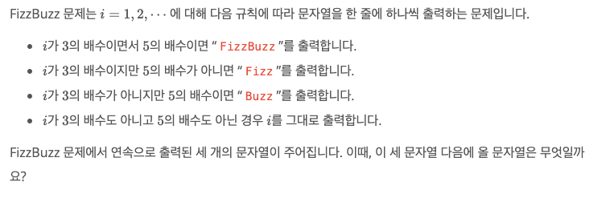
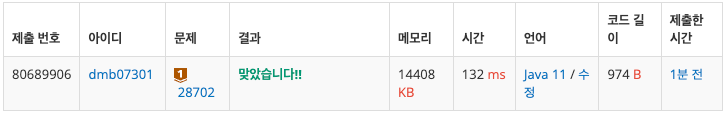
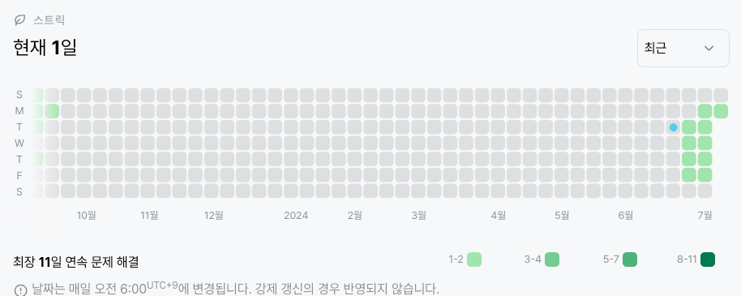

# 28702번 : FizzBuzz(브론즈1)
|시간 제한|메모리 제한|
|:--:|:--:|
|1초|128MB|

## 문제

## 문제 설명



## 입력
```
Fizz
Buzz
11
```

## 출력
```
Fizz
```
## 코드
```java
import java.io.BufferedReader;
import java.io.IOException;
import java.io.InputStreamReader;
import java.util.ArrayList;
import java.util.List;

public class Main {
    public static void main(String[] args) throws IOException {
        BufferedReader br = new BufferedReader(new InputStreamReader(System.in));
        List<String> arr = new ArrayList<>();
        String ans = "";

        for(int j = 0; j < 3; j++){
            arr.add(br.readLine());
        }

        for(int k = 0; k < 3; k++){
            if(arr.get(k).matches("[+-]?\\d*(\\.\\d)?")){
                int i = Integer.parseInt(arr.get(k)) + 3 - k;

                if(i % 3 == 0){
                    ans = "Fizz";
                    if(i % 5 == 0){
                        ans = "FizzBuzz";
                    }
                } else if(i%5==0){
                    ans = "Buzz";
                } else ans = Integer.toString(i);
            }
        }

        System.out.println(ans);
    }
}

```

## 채점 결과


## 스트릭 (또는 자신이 매일 문제를 풀었다는 증거)

