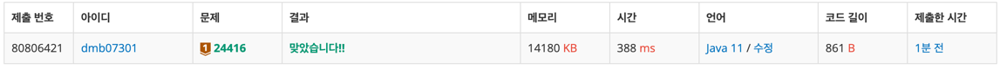
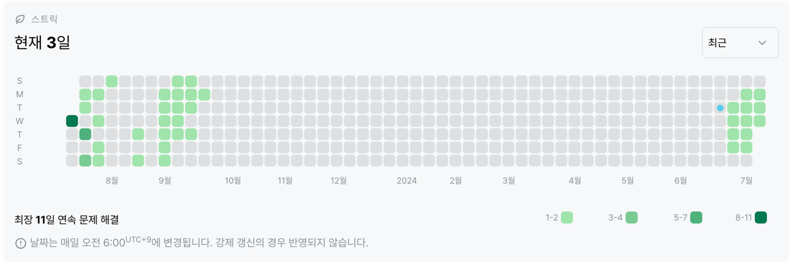

# 24416번 : 알고리즘 수업 - 피보나치 수 1
|시간 제한|메모리 제한|
|:--:|:--:|
|1초|128MB|

## 문제

## 문제 설명
dp


## 입력
```
30
```

## 출력
```
832040 28
```
## 코드
```java
import java.io.BufferedReader;
import java.io.IOException;
import java.io.InputStreamReader;

public class Main {
    public static void main(String[] args) throws IOException {
        BufferedReader br = new BufferedReader(new InputStreamReader(System.in));
        int n = Integer.parseInt(br.readLine());

        System.out.println(recurFib(n));
        System.out.println(dpFib(n));
    }

    private static int recurFib(int n) {
        if (n == 1 || n == 2) {
            return 1;
        } else {
            return (recurFib(n - 1) + recurFib(n - 2));
        }
    }

    private static int dpFib(int n) {
        int[] arr = new int[n];
        arr[0] = 1;
        arr[1] = 1;
        int count = 1;

        for (int i = 3; i < n; i++) {
            arr[i] = arr[i - 1] + arr[i - 2];
            count++;
        }
        return count;
    }
}


```

## 채점 결과


## 스트릭 (또는 자신이 매일 문제를 풀었다는 증거)

