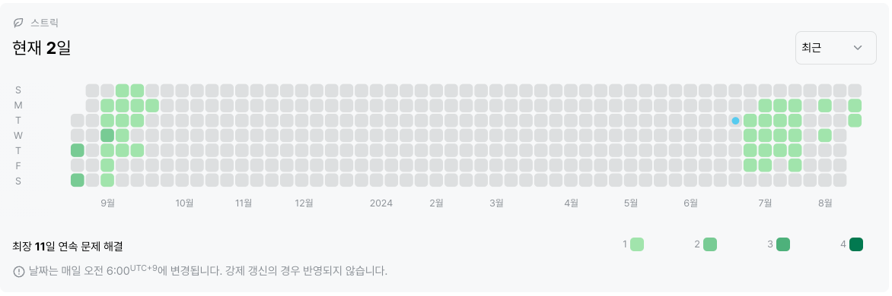

# 2747번 : 피보나치 수
|시간 제한|메모리 제한|
|:--:|:--:|
|1초|128MB|

## 문제
피보나치 수는 0과 1로 시작한다. 0번째 피보나치 수는 0이고, 1번째 피보나치 수는 1이다. 그 다음 2번째 부터는 바로 앞 두 피보나치 수의 합이 된다.
이를 식으로 써보면 Fn = Fn-1 + Fn-2 (n ≥ 2)가 된다.
n=17일때 까지 피보나치 수를 써보면 다음과 같다.
0, 1, 1, 2, 3, 5, 8, 13, 21, 34, 55, 89, 144, 233, 377, 610, 987, 1597
n이 주어졌을 때, n번째 피보나치 수를 구하는 프로그램을 작성하시오.

## 문제 설명
dp의 메모이제이션 기법 사용


## 입력
```
10
```

## 출력
```
55
```
## 코드
```java
import java.io.BufferedReader;
import java.io.IOException;
import java.io.InputStreamReader;

public class Main {
    public static void main(String[] args) throws IOException {
        BufferedReader br = new BufferedReader(new InputStreamReader(System.in));
        int N = Integer.parseInt(br.readLine());
        int[] dp = new int[46];
        dp[1] = 1;
        for (int i = 2; i <= N; i++) {
            dp[i] = dp[i - 1] + dp[i - 2];
        }

        System.out.println(dp[N]);
    }
}
```

## 채점 결과


## 스트릭 (또는 자신이 매일 문제를 풀었다는 증거)

