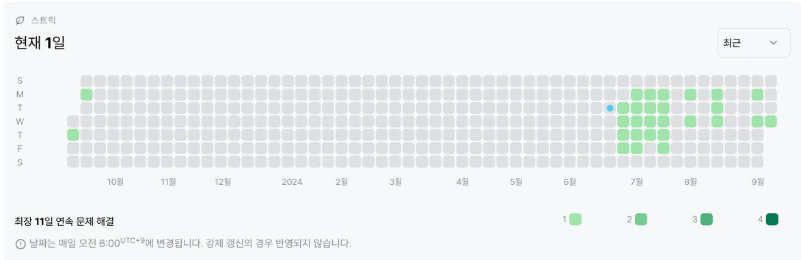

# 1427번 : 소트인사이드
|시간 제한|메모리 제한|
|:--:|:--:|
|1초|128MB|

## 문제
배열을 정렬하는 것은 쉽다. 수가 주어지면, 그 수의 각 자리수를 내림차순으로 정렬해보자.

## 문제 설명
첫째 줄에 정렬하려고 하는 수 N이 주어진다. N은 1,000,000,000보다 작거나 같은 자연수이다.

첫째 줄에 자리수를 내림차순으로 정렬한 수를 출력한다.

## 입력
```
61423
```

## 출력
```
64321
```
## 코드
```java
import java.io.BufferedReader;
import java.io.IOException;
import java.io.InputStreamReader;
import java.util.Collections;
import java.util.List;
import java.util.stream.Collectors;

public class Main {
    public static void main(String[] args) throws IOException {
        BufferedReader br = new BufferedReader(new InputStreamReader(System.in));
        String n = br.readLine();

        List<Integer> arr = n.chars()
            .mapToObj(c -> Character.getNumericValue(c))
            .collect(Collectors.toList());

        Collections.sort(arr, Collections.reverseOrder());

        for (int i : arr) {
            System.out.print(i);
        }
    }
}
```

## 채점 결과


## 스트릭 (또는 자신이 매일 문제를 풀었다는 증거)
