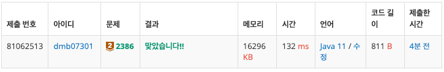
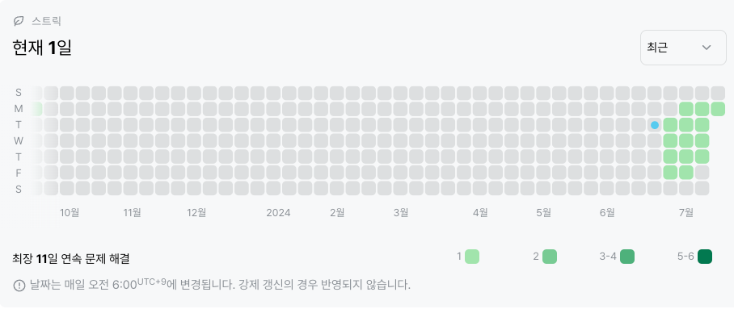

# 2386번 : 도비의 영어 공부
|시간 제한|메모리 제한|
|:--:|:--:|
|1초|128MB|

## 문제
꿍은 도비의 자유를 위해 영어를 가르치기로 결심했다. 하지만 도비는 바보라 ABC부터 배워야 한다.
그래서 꿍은 영어 문장과 알파벳 하나가 주어지면 그 알파벳이 문장에서 몇 번 나타나는지를 세는 문제들을 내주었다. 하지만 도비는 마법사고 컴공도 마법사다.
여러분은 도비를 위해 문제의 답을 알려주는 프로그램을 만들수 있을것이다!

## 문제 설명
입력은 몇 개의 줄들로 이루어진다.
각 줄에는 하나의 소문자와 영어 문장이 공백으로 구분되어 주어진다.
각 문장은 길이가 1에서 250이며 입력의 마지막은 #이다.

출력의 각 줄은 입력으로 주어진 소문자와 그 소문자 알파벳이 나타난 횟수로 이루어진다. 이때 문장에서 해당 알파벳이 소문자로 나타나던 대문자로 나타나던 모두 세야 한다.

## 입력
```
g Programming Contest
n New Zealand
x This is quite a simple problem.
#
```

## 출력
```
g 2
n 2
x 0
```
## 코드
```java
import java.io.BufferedReader;
import java.io.IOException;
import java.io.InputStreamReader;
import java.util.List;
import java.util.Objects;

public class Main {
    public static void main(String[] args) throws IOException {
        BufferedReader br = new BufferedReader(new InputStreamReader(System.in));
        List<String> input;
        int count;

        while (true) {
            count = 0;
            input = List.of(br.readLine().split(""));
            if (Objects.equals(input.get(0), "#")) {
                break;
            }

            for (int i = 1; i < input.size(); i++) {
                if ((input.get(0).equalsIgnoreCase(input.get(i)))) {
                    count++;
                }
            }
            System.out.println(input.get(0) + " " + count);
        }

    }
}


```

## 채점 결과

## 스트릭 (또는 자신이 매일 문제를 풀었다는 증거)
