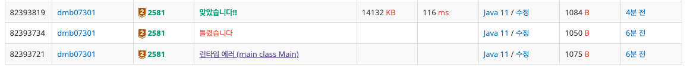
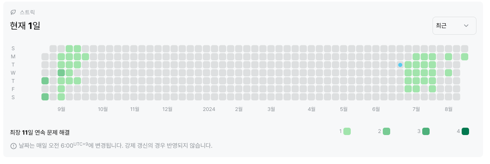

# 2581번 : 소수
|시간 제한|메모리 제한|
|:--:|:--:|
|1초|128MB|

## 문제
자연수 M과 N이 주어질 때 M이상 N이하의 자연수 중 소수인 것을 모두 골라 이들 소수의 합과 최솟값을 찾는 프로그램을 작성하시오.
예를 들어 M=60, N=100인 경우 60이상 100이하의 자연수 중 소수는 61, 67, 71, 73, 79, 83, 89, 97 총 8개가 있으므로, 이들 소수의 합은 620이고, 최솟값은 61이 된다.

## 문제 설명
입력의 첫째 줄에 M이, 둘째 줄에 N이 주어진다.
M과 N은 10,000이하의 자연수이며, M은 N보다 작거나 같다.

M이상 N이하의 자연수 중 소수인 것을 모두 찾아 첫째 줄에 그 합을, 둘째 줄에 그 중 최솟값을 출력한다.
단, M이상 N이하의 자연수 중 소수가 없을 경우는 첫째 줄에 -1을 출력한다.
## 입력
```
60
100
```

## 출력
```
620
61
```
## 코드
```java
import java.io.BufferedReader;
import java.io.IOException;
import java.io.InputStreamReader;

public class Main {
    public static void main(String[] args) throws IOException {
        BufferedReader br = new BufferedReader(new InputStreamReader(System.in));
        int M = Integer.parseInt(br.readLine());
        int N = Integer.parseInt(br.readLine());
        int min = 10000;
        int total = 0;
        int count = 0;

        for (int i = M; i <= N; i++) {
            if (checkNum(i)) {
                if (min > i) {
                    min = i;
                }
                total += i;
                count += 1;
            }
        }
        if (count == 0) {
            System.out.println(-1);
        } else {
            System.out.println(total);
            System.out.println(min);
        }
    }

    private static boolean checkNum(int i) {
        if(i == 1) return false;

        for (int j = 1; j <= i; j++) {
            if ((j != 1 && j != i) && i % j == 0) {
                return false;
            }
        }

        return true;
    }
}

```

## 채점 결과


## 스트릭 (또는 자신이 매일 문제를 풀었다는 증거)
