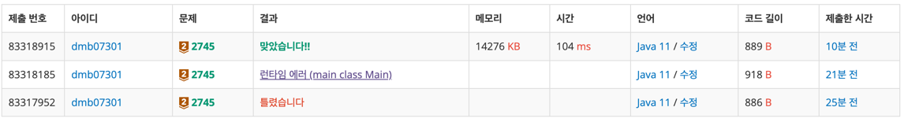

# 2745번 : 진법 변환
|시간 제한|메모리 제한|
|:--:|:--:|
|1초|128MB|

## 문제
B진법 수 N이 주어진다. 이 수를 10진법으로 바꿔 출력하는 프로그램을 작성하시오.
10진법을 넘어가는 진법은 숫자로 표시할 수 없는 자리가 있다. 이런 경우에는 다음과 같이 알파벳 대문자를 사용한다.
A: 10, B: 11, ..., F: 15, ..., Y: 34, Z: 35

## 문제 설명
첫째 줄에 N과 B가 주어진다. (2 ≤ B ≤ 36)
B진법 수 N을 10진법으로 바꾸면, 항상 10억보다 작거나 같다.

첫째 줄에 B진법 수 N을 10진법으로 출력한다.

## 입력
```
ZZZZZ 36
```

## 출력
```
60466175
```

## 코드
```java
import java.io.BufferedReader;
import java.io.IOException;
import java.io.InputStreamReader;
import java.util.StringTokenizer;

public class Main {
    public static void main(String[] args) throws IOException {
        BufferedReader br = new BufferedReader(new InputStreamReader(System.in));
        StringTokenizer st = new StringTokenizer(br.readLine());

        String n = st.nextToken();
        int b = Integer.parseInt(st.nextToken());

        System.out.println(converter(n, b));
    }

    private static int converter(String n, int b) {
        char[] nums = n.toCharArray();
        int answer = 0;

        for (int i = 0; i < nums.length; i++) {
            if (nums[i] >= 'A') {
                answer = answer * b + (nums[i] - 'A' + 10);
            } else {
                answer = answer * b + (nums[i] - '0');
            }
        }

        return answer;
    }
}

```

## 채점 결과


## 스트릭 (또는 자신이 매일 문제를 풀었다는 증거)
