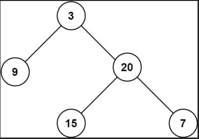

# LinkedListCycle
|시간 제한|메모리 제한|
|:--:|:--:|
|1초|128MB|

## 문제
Given the root of a binary tree, return its maximum depth.
A binary tree's maximum depth is the number of nodes along the longest path from the root node down to the farthest leaf node.

## 문제 설명
이진 트리가 주어지면 그걸 뒤집는 문제


## 입력
```
root = [3,9,20,null,null,15,7]
```

## 출력
```
3
```

## 코드
```java
/**
 * Definition for a binary tree node.
 * public class TreeNode {
 *     int val;
 *     TreeNode left;
 *     TreeNode right;
 *     TreeNode() {}
 *     TreeNode(int val) { this.val = val; }
 *     TreeNode(int val, TreeNode left, TreeNode right) {
 *         this.val = val;
 *         this.left = left;
 *         this.right = right;
 *     }
 * }
 */
class Solution {
    public int maxDepth(TreeNode root) {
        if(root == null){
            return 0;
        }

        return Math.max(maxDepth(root.left), maxDepth(root.right)) + 1;
    }
}
```

## 채점 결과!
[img_1.png](img_1.png)