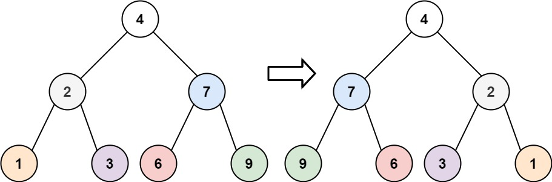

# LinkedListCycle
|시간 제한|메모리 제한|
|:--:|:--:|
|1초|128MB|

## 문제
Given the root of a binary tree, invert the tree, and return its root.

## 문제 설명
이진 트리가 주어지면 그걸 뒤집는 문제


## 입력
```
Input: root = [4,2,7,1,3,6,9]
```

## 출력
```
Output: [4,7,2,9,6,3,1]
```

## 코드
```java
/**
 * Definition for a binary tree node.
 * public class TreeNode {
 *     int val;
 *     TreeNode left;
 *     TreeNode right;
 *     TreeNode() {}
 *     TreeNode(int val) { this.val = val; }
 *     TreeNode(int val, TreeNode left, TreeNode right) {
 *         this.val = val;
 *         this.left = left;
 *         this.right = right;
 *     }
 * }
 */
class Solution {
    public TreeNode invertTree(TreeNode root) {
        if(root == null){
            return null;
        }

        if(root.left != null){
            invertTree(root.left);
        }

        if(root.right != null){
            invertTree(root.right);
        }

        TreeNode temp = root.left;
        root.left = root.right;
        root.right = temp;
        return root;
    }
}
```

## 채점 결과
