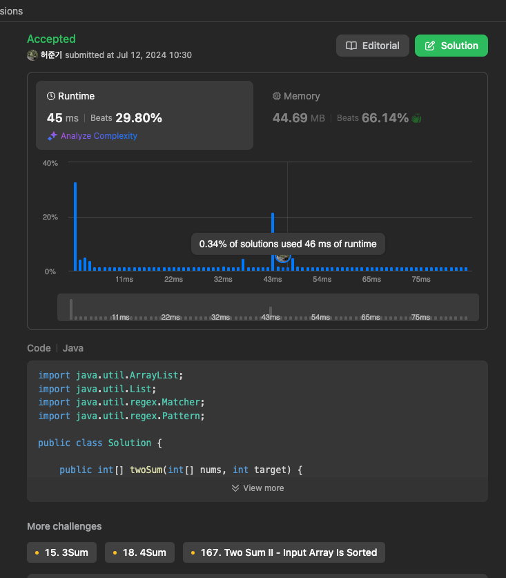

# twosum
|시간 제한|메모리 제한|
|:--:|:--:|
|1초|128MB|

## 문제
Given an array of integers nums and an integer target, return indices of the two numbers such that they add up to target.

You may assume that each input would have exactly one solution, and you may not use the same element twice.

You can return the answer in any order.
## 문제 설명
숫자 배열과 목표 숫자가 주어지면 배열에 있는 숫자 두개를 더해서 목표 숫자가 되는
인덱스 구하기


## 입력
```
nums = [2,7,11,15], target = 9
```

## 출력
```
[0,1]
```
## 코드
```java
    import java.util.ArrayList;
import java.util.List;
import java.util.regex.Matcher;
import java.util.regex.Pattern;

public class Solution {

    public int[] twoSum(int[] nums, int target) {
        for (int i = 0; i < nums.length - 1; i++) {
            for (int j = i + 1; j < nums.length; j++) {
                if (nums[i] + nums[j] == target) {
                    return new int[]{i, j};
                }
            }
        }
        return new int[]{};
    }

    public static void main(String[] args) {
        // Example input handling
        String input = "nums = [2,7,11,15], target = 9";
        List<String> inputList = List.of(input.split(", "));
        int[] arr = getNum(inputList.get(0));
        int target = getNum(inputList.get(1))[0];

        Solution solution = new Solution();
        int[] result = solution.twoSum(arr, target);

        for (int index : result) {
            System.out.print(index + " ");
        }
    }

    private static int[] getNum(String input) {
        List<Integer> arr = new ArrayList<>();
        Pattern pattern = Pattern.compile("\\d+");
        Matcher matcher = pattern.matcher(input);

        while (matcher.find()) {
            arr.add(Integer.parseInt(matcher.group()));
        }

        return arr.stream().mapToInt(i -> i).toArray();
    }
}
```

## 채점 결과


## 스트릭 (또는 자신이 매일 문제를 풀었다는 증거)

