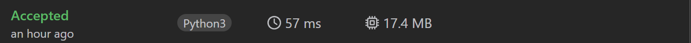

# 1번: Two Sum

## 문제
Given an array of integers nums and an integer target, return indices of the two numbers such that they add up to target.

You may assume that each input would have exactly one solution, and you may not use the same element twice.

You can return the answer in any order.

## 예제 입력 1
```text
nums = [2,7,11,15], target = 9
```
## 예제 출력 1
```text
[0,1]
```
## 예제 입력 2
```text
nums = [3,2,4], target = 6
```
## 예제 출력 2
```text
[1,2]
```
## 예제 입력 3
```text
nums = [3,3], target = 6
```
## 예제 출력 3
```text
[0,1]
```

## 코드
```python
class Solution:
    def twoSum(self, nums: [int], target: int) -> [int]:
        fp = 0
        bp = len(nums) - 1
        sortedList = sorted(nums)
        while True:
            if sortedList[fp] + sortedList[bp] < target:
                fp += 1
            elif sortedList[fp] + sortedList[bp] > target:
                bp -= 1
            else:
                break
        result = []
        result.append(nums.index(sortedList[fp]))
        result.append(len(nums) - nums[-1::-1].index(sortedList[bp]) - 1)
        return(result)
```

## 채점 결과

