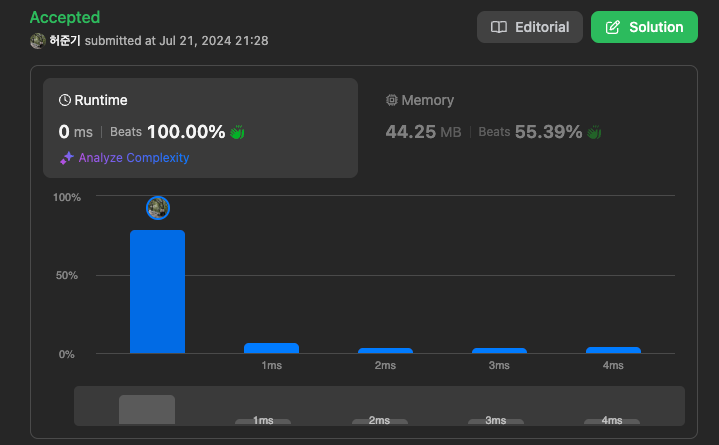

# LinkedListCycle
|시간 제한|메모리 제한|
|:--:|:--:|
|1초|128MB|

## 문제
Given head, the head of a linked list, determine if the linked list has a cycle in it.

There is a cycle in a linked list if there is some node in the list that can be reached again by continuously following the next pointer. Internally, pos is used to denote the index of the node that tail's next pointer is connected to. Note that pos is not passed as a parameter.

Return true if there is a cycle in the linked list. Otherwise, return false.
## 문제 설명
링크드 리스트에 순환이 있는지 확인


## 입력
```
head = [3,2,0,-4], pos = 1
```

## 출력
```
true
```
## 코드
```java
public class Solution {
    public boolean hasCycle(ListNode head) {
        if(head == null){
            return false;
        }
        ListNode pre, now;
        pre = now = head;
        while(now != null && now.next != null){
            pre = pre.next;
            now = now.next.next;
            if(pre == now){
                return true;
            }
        }
        return false;
    }
}
```

## 채점 결과

