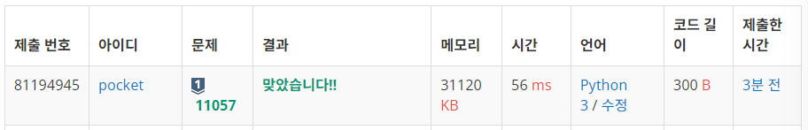
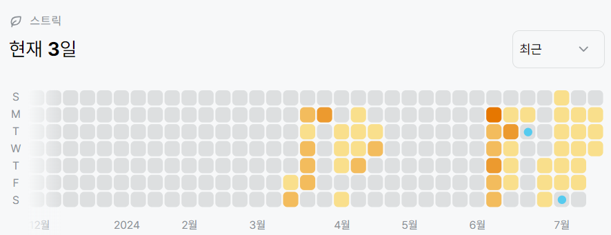

# 11057번: 오르막 수 (실버 1)
| 시간 제한 | 메모리 제한 |
|:-----:|:------:|
|  1초   | 256MB  |

## 문제
오르막 수는 수의 자리가 오름차순을 이루는 수를 말한다. 이때, 인접한 수가 같아도 오름차순으로 친다.

예를 들어, 2234와 3678, 11119는 오르막 수이지만, 2232, 3676, 91111은 오르막 수가 아니다.

수의 길이 N이 주어졌을 때, 오르막 수의 개수를 구하는 프로그램을 작성하시오. 수는 0으로 시작할 수 있다.

## 문제 설명
```text
1. 0~9까지 숫자를 나열하고, 다음 자릿수 중 자기보다 큰 수에 자기자신의 값을 더해가면 된다
2. 즉 dp[i][j] += dp[i - 1][0 ~ j]라는 식을 세울 수 있다.
3. 이렇게 구한 dp테이블의 가장 마지막 라인 값을 총합하여 출력한다.
```

## 입력
첫째 줄에 N (1 ≤ N ≤ 1,000)이 주어진다.

## 출력
첫째 줄에 길이가 N인 오르막 수의 개수를 10,007로 나눈 나머지를 출력한다.

## 예제 입력 1 
```text
1
```

## 예제 출력 1 
```text
10
```

## 예제 입력 2
```text
2
```

## 예제 출력 2 
```text
55
```

## 예제 입력 3 
```text
3
```

## 예제 출력 3 
```text
220
```

## 코드
```python
import sys
input = sys.stdin.readline

N = int(input().rstrip())
dp = [[0 for _ in range(10)] for _ in range(N)]

for i in range(10):
    dp[0][i] = 1

for i in range(1, N):
    for j in range(0, 10):
        for k in range(0, j + 1):
            dp[i][j] += dp[i - 1][k]

print(sum(dp[-1]) % 10007)

```

## 채점 결과


## 스트릭

