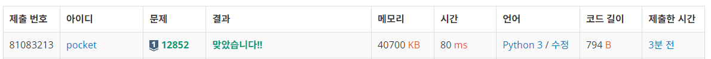
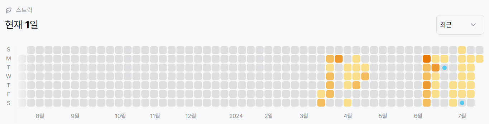

# 12852번: 1로 만들기 2 (실버 1)
| 시간 제한 | 메모리 제한 |
|:-----:|:------:|
| 0.5초  | 512MB  |

## 문제
정수 X에 사용할 수 있는 연산은 다음과 같이 세 가지 이다.

X가 3으로 나누어 떨어지면, 3으로 나눈다.
X가 2로 나누어 떨어지면, 2로 나눈다.
1을 뺀다.
정수 N이 주어졌을 때, 위와 같은 연산 세 개를 적절히 사용해서 1을 만들려고 한다. 연산을 사용하는 횟수의 최솟값을 출력하시오.

## 문제 설명
```text
1. bfs로도 충분히 풀 수 있다.
2. 방문처리를 해주고, 3으로 나누어 떨어지는 경우, 2로 나누어 떨어지는 경우, 1을 빼는 경우 순으로 큐에 append한다.
3. 3으로 나누어 떨어지는 경우가 가장 먼저 append되는 이유는, 3으로 나누어 떨어진다면 2로 나누는 것 보다 더 많은 값을 지나갈 수 있기 때문. 따라서 더 큰 값의 변화가 있는 것을 우선적으로 append함
4. n이 1이라면, 연산 개수와 숫자 출력
```


## 입력
첫째 줄에 1보다 크거나 같고, 106보다 작거나 같은 자연수 N이 주어진다.

## 출력
첫째 줄에 연산을 하는 횟수의 최솟값을 출력한다.

둘째 줄에는 N을 1로 만드는 방법에 포함되어 있는 수를 공백으로 구분해서 순서대로 출력한다. 정답이 여러 가지인 경우에는 아무거나 출력한다.


## 예제 입력 1 
```text
2
```

## 예제 출력 1 
```text
1
2 1
```

## 예제 입력 2 
```text
10
```

## 예제 출력 2 
```text
3
10 9 3 1
```

## 코드
```python
from collections import deque
import sys
input = sys.stdin.readline

N = int(input().rstrip())

def bfs(start):
    visited = [False for _ in range(start + 1)]
    visited[start] = True

    q = deque([(start, [start])])

    while q:
        n, path = q.popleft()

        if n == 1:
            print(len(path) - 1)
            print(*path)
            exit(0)

        if n // 3 >= 1 and n % 3 == 0 and not visited[n // 3]:
            visited[n // 3] = True
            q.append((n // 3, path + [n // 3]))

        if n // 2 >= 1 and n % 2 == 0 and not visited[n // 2]:
            visited[n // 2] = True
            q.append((n // 2, path + [n // 2]))

        if n - 1 >= 1 and not visited[n - 1]:
             visited[n - 1] = True
             q.append((n - 1, path + [n - 1]))

bfs(N)

```

## 채점 결과


## 스트릭

