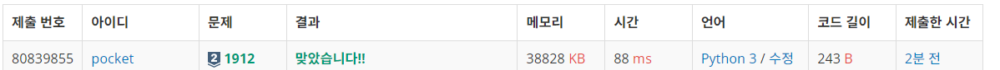
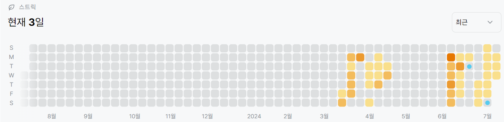

# 1912번: 연속합 (실버 2)
| 시간 제한 | 메모리 제한 |
|:-----:|:------:|
|  1초   | 128MB  |

## 문제
n개의 정수로 이루어진 임의의 수열이 주어진다. 우리는 이 중 연속된 몇 개의 수를 선택해서 구할 수 있는 합 중 가장 큰 합을 구하려고 한다. 단, 수는 한 개 이상 선택해야 한다.

예를 들어서 10, -4, 3, 1, 5, 6, -35, 12, 21, -1 이라는 수열이 주어졌다고 하자. 여기서 정답은 12+21인 33이 정답이 된다.

## 문제 설명
```text
1. dp 점화식을 구한다.
2. 점화식 dp[i] = max(dp[i - 1] + nums[i], nums[i])
3. dp로 구한 값중 가장 큰 값을 출력한다.
```


## 입력
첫째 줄에 정수 n(1 ≤ n ≤ 100,000)이 주어지고 둘째 줄에는 n개의 정수로 이루어진 수열이 주어진다. 수는 -1,000보다 크거나 같고, 1,000보다 작거나 같은 정수이다.

## 출력
첫째 줄에 답을 출력한다.


## 예제 입력 1 
```text
10
10 -4 3 1 5 6 -35 12 21 -1
```

## 예제 출력 1 
```text
33
```

## 예제 입력 2 
```text
10
2 1 -4 3 4 -4 6 5 -5 1
```

## 예제 출력 2 
```text
14
```

## 예제 입력 3 
```text
5
-1 -2 -3 -4 -5
```

## 예제 출력 3 
```text
-1
```

## 코드
```python
import sys
input = sys.stdin.readline

n = int(input().rstrip())
nums = list(map(int, input().rstrip().split()))

dp = [0 for _ in range(n)]
dp[0] = nums[0]

for i in range(1, n):
    dp[i] = max(dp[i - 1] + nums[i], nums[i])

print(max(dp))
```

## 채점 결과


## 스트릭

