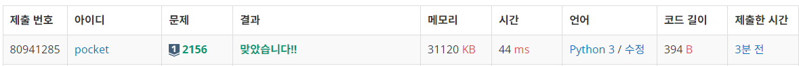
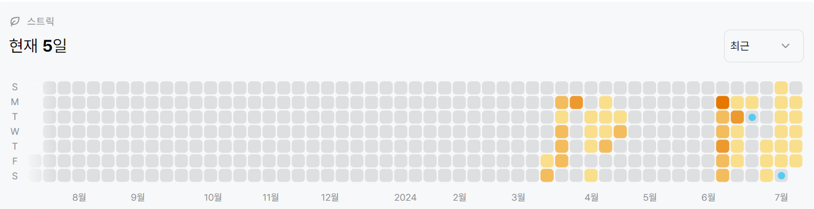

# 2156번: 포도주 시식 (실버 1)
| 시간 제한 | 메모리 제한 |
|:-----:|:------:|
|  2초   | 128MB  |

## 문제
효주는 포도주 시식회에 갔다. 그 곳에 갔더니, 테이블 위에 다양한 포도주가 들어있는 포도주 잔이 일렬로 놓여 있었다. 효주는 포도주 시식을 하려고 하는데, 여기에는 다음과 같은 두 가지 규칙이 있다.

포도주 잔을 선택하면 그 잔에 들어있는 포도주는 모두 마셔야 하고, 마신 후에는 원래 위치에 다시 놓아야 한다.
연속으로 놓여 있는 3잔을 모두 마실 수는 없다.
효주는 될 수 있는 대로 많은 양의 포도주를 맛보기 위해서 어떤 포도주 잔을 선택해야 할지 고민하고 있다. 1부터 n까지의 번호가 붙어 있는 n개의 포도주 잔이 순서대로 테이블 위에 놓여 있고, 각 포도주 잔에 들어있는 포도주의 양이 주어졌을 때, 효주를 도와 가장 많은 양의 포도주를 마실 수 있도록 하는 프로그램을 작성하시오. 

예를 들어 6개의 포도주 잔이 있고, 각각의 잔에 순서대로 6, 10, 13, 9, 8, 1 만큼의 포도주가 들어 있을 때, 첫 번째, 두 번째, 네 번째, 다섯 번째 포도주 잔을 선택하면 총 포도주 양이 33으로 최대로 마실 수 있다.

## 문제 설명
```text
1. dp 점화식을 구한다.
2. 점화식은 다음과 같다.
dp[i] = max([dp[i - 3] + nums[i - 1] + nums[i], dp[i - 2] + nums[i], dp[i - 1]])
위 식은 연속으로 3개를 밟지 않고, (세 칸 앞, 한 칸 앞, 현재), (두 칸 앞, 현재), (바로 직전) 세 가지 경우 중 가장 큰 값을 유지하는 방법이다. 
```

## 입력
첫째 줄에 포도주 잔의 개수 n이 주어진다. (1 ≤ n ≤ 10,000) 둘째 줄부터 n+1번째 줄까지 포도주 잔에 들어있는 포도주의 양이 순서대로 주어진다. 포도주의 양은 1,000 이하의 음이 아닌 정수이다.

## 출력
첫째 줄에 최대로 마실 수 있는 포도주의 양을 출력한다.


## 예제 입력 1 
```text
6
6
10
13
9
8
1
```

## 예제 출력 1 
```text
33
```

## 코드
```python
import sys
input = sys.stdin.readline

N = int(input().rstrip())
nums = [int(input().rstrip()) for _ in range(N)]

dp = [0 for _ in range(N)]
dp[0] = nums[0]
if N > 1:
    dp[1] = nums[0] + nums[1]
if N > 2:
    dp[2] = max([nums[0] + nums[2], nums[1] + nums[2], dp[1]])
for i in range(3, N):
    dp[i] = max([dp[i - 3] + nums[i - 1] + nums[i], dp[i - 2] + nums[i], dp[i - 1]])

print(max(dp))


```

## 채점 결과


## 스트릭

