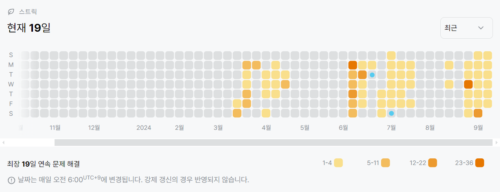

10942번: 팰린드롬? (골드 4)
| 시간 제한 | 메모리 제한 |
|:-----:|:------:|
|  (pypy3) 1.5초   | 256MB  |

## 문제
명우는 홍준이와 함께 팰린드롬 놀이를 해보려고 한다.

먼저, 홍준이는 자연수 N개를 칠판에 적는다. 그 다음, 명우에게 질문을 총 M번 한다.

각 질문은 두 정수 S와 E(1 ≤ S ≤ E ≤ N)로 나타낼 수 있으며, S번째 수부터 E번째 까지 수가 팰린드롬을 이루는지를 물어보며, 명우는 각 질문에 대해 팰린드롬이다 또는 아니다를 말해야 한다.

예를 들어, 홍준이가 칠판에 적은 수가 1, 2, 1, 3, 1, 2, 1라고 하자.

S = 1, E = 3인 경우 1, 2, 1은 팰린드롬이다.
S = 2, E = 5인 경우 2, 1, 3, 1은 팰린드롬이 아니다.
S = 3, E = 3인 경우 1은 팰린드롬이다.
S = 5, E = 7인 경우 1, 2, 1은 팰린드롬이다.
자연수 N개와 질문 M개가 모두 주어졌을 때, 명우의 대답을 구하는 프로그램을 작성하시오.


## 문제 설명
```text
1. dp문제이다.
2. 1자리라면 True
3. 2자리라면, 양 끝 값이 같을 때 True
4. 3자리 이상부터는 양 끝 값이 같고, 그 사이가 팰린드롬이면 True
```

## 입력
첫째 줄에 수열의 크기 N (1 ≤ N ≤ 2,000)이 주어진다.

둘째 줄에는 홍준이가 칠판에 적은 수 N개가 순서대로 주어진다. 칠판에 적은 수는 100,000보다 작거나 같은 자연수이다.

셋째 줄에는 홍준이가 한 질문의 개수 M (1 ≤ M ≤ 1,000,000)이 주어진다.

넷째 줄부터 M개의 줄에는 홍준이가 명우에게 한 질문 S와 E가 한 줄에 하나씩 주어진다.


## 출력
총 M개의 줄에 걸쳐 홍준이의 질문에 대한 명우의 답을 입력으로 주어진 순서에 따라서 출력한다. 팰린드롬인 경우에는 1, 아닌 경우에는 0을 출력한다.


## 예제 입력 1 
```text
7
1 2 1 3 1 2 1
4
1 3
2 5
3 3
5 7
```
## 예제 출력 1 
```text
1
0
1
1
```

## 코드
```python
import sys
input = sys.stdin.readline

N = int(input().rstrip())
nums = list(map(int, input().rstrip().split()))
M = int(input().rstrip())
se = [list(map(int, input().rstrip().split())) for _ in range(M)]

dp = [[False for _ in range(N)] for _ in range(N)]

for i in range(N):
    for start in range(N - i):
        if start == start + i:
            dp[start][start + i] = True
        else:
            if nums[start] == nums[start + i]:
                if i == 1:
                    dp[start][start + i] = True
                else:
                    if dp[start + 1][start + i - 1]:
                        dp[start][start + i] = True

for s, e in se:
    print(1 if dp[s - 1][e - 1] else 0)
```

## 채점 결과


## 스트릭
