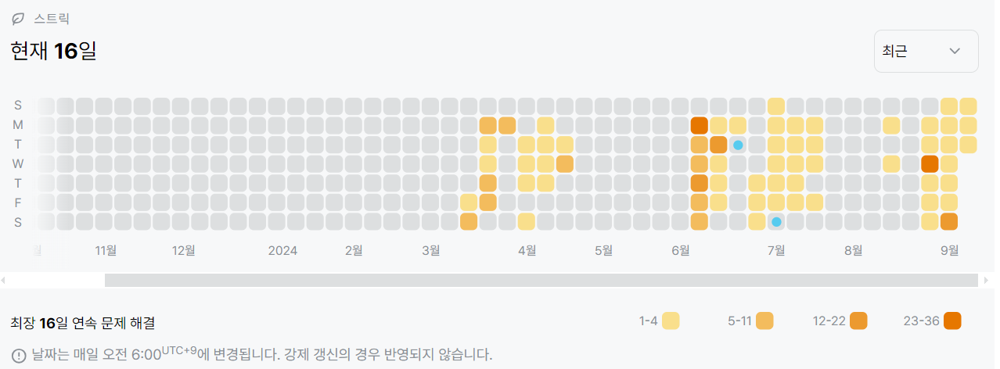

1197번: 최소 스패닝 트리 (골드 4)
| 시간 제한 | 메모리 제한 |
|:-----:|:------:|
|  2초   | 128MB  |

## 문제
그래프가 주어졌을 때, 그 그래프의 최소 스패닝 트리를 구하는 프로그램을 작성하시오.

최소 스패닝 트리는, 주어진 그래프의 모든 정점들을 연결하는 부분 그래프 중에서 그 가중치의 합이 최소인 트리를 말한다.


## 문제 설명
```text
1. 크루스칼 알고리즘과 유니온 파인드를 활용한다.
2. 간선을 가중치 기준으로 정렬한다.
3. 간선을 하나씩 추가하는데, 이 때 순환 경로가 생기지 않도록 한다.
4. 순환 경로의 판단은 유니온-파인드에서 동일한 부모를 갖고있는지 아닌지 확인한다. 동일한 부모라면 순환 경로이므로 pass한다.
5. 결과를 출력한다.
```

## 입력
첫째 줄에 정점의 개수 V(1 ≤ V ≤ 10,000)와 간선의 개수 E(1 ≤ E ≤ 100,000)가 주어진다. 다음 E개의 줄에는 각 간선에 대한 정보를 나타내는 세 정수 A, B, C가 주어진다. 이는 A번 정점과 B번 정점이 가중치 C인 간선으로 연결되어 있다는 의미이다. C는 음수일 수도 있으며, 절댓값이 1,000,000을 넘지 않는다.

그래프의 정점은 1번부터 V번까지 번호가 매겨져 있고, 임의의 두 정점 사이에 경로가 있다. 최소 스패닝 트리의 가중치가 -2,147,483,648보다 크거나 같고, 2,147,483,647보다 작거나 같은 데이터만 입력으로 주어진다.

## 출력
첫째 줄에 최소 스패닝 트리의 가중치를 출력한다.


## 예제 입력 1 
```text
3 3
1 2 1
2 3 2
1 3 3
```
## 예제 출력 1 
```text
3
```


## 코드
```python
import sys
input = sys.stdin.readline

V, E = map(int, input().rstrip().split())
edges = [list(map(int, input().rstrip().split())) for _ in range(E)]
parent = [i for i in range(V + 1)]
edges.sort(key=lambda x: x[2])

def find(x):
    if parent[x] != x:
        return find(parent[x])
    return parent[x]

def union(x, y):
    if x > y:
        x, y = y, x
    px, py = find(x), find(y)
    if px < py:
        parent[px] = py
    else:
        parent[py] = px

res = 0
for u, v, cost in edges:
    if find(u) != find(v):
        union(u, v)
        res += cost

print(res)

```

## 채점 결과


## 스트릭
