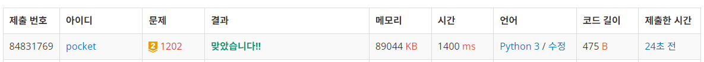
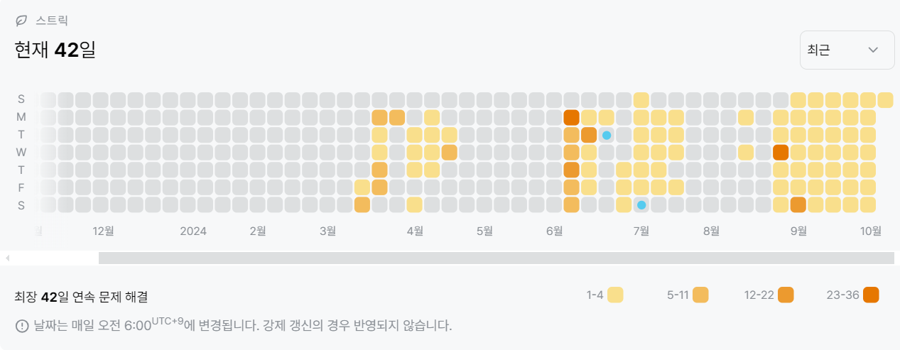

1202번: 보석 도둑 (골드 2)
| 시간 제한 | 메모리 제한 |
|:-----:|:------:|
|  1초   | 256MB  |

## 문제
세계적인 도둑 상덕이는 보석점을 털기로 결심했다.

상덕이가 털 보석점에는 보석이 총 N개 있다. 각 보석은 무게 Mi와 가격 Vi를 가지고 있다. 상덕이는 가방을 K개 가지고 있고, 각 가방에 담을 수 있는 최대 무게는 Ci이다. 가방에는 최대 한 개의 보석만 넣을 수 있다.

상덕이가 훔칠 수 있는 보석의 최대 가격을 구하는 프로그램을 작성하시오.


## 문제 설명
```text
1. 최대힙을 사용하는 문제이다. 
2. 가방을 순차적으로 방문한다.
3. 방문하면서, 가방에 들어갈 수 있는 보석 중 가장 큰 값을 가방에 추가한다.
4. 추가한 보석은 탐색 대상에서 제외한다.
```

## 입력
첫째 줄에 N과 K가 주어진다. (1 ≤ N, K ≤ 300,000)

다음 N개 줄에는 각 보석의 정보 Mi와 Vi가 주어진다. (0 ≤ Mi, Vi ≤ 1,000,000)

다음 K개 줄에는 가방에 담을 수 있는 최대 무게 Ci가 주어진다. (1 ≤ Ci ≤ 100,000,000)

모든 숫자는 양의 정수이다.

## 출력
첫째 줄에 상덕이가 훔칠 수 있는 보석 가격의 합의 최댓값을 출력한다.


## 예제 입력 1 
```text
2 1
5 10
100 100
11
```
## 예제 출력 1 
```text
10
```

## 예제 입력 2
```text
3 2
1 65
5 23
2 99
10
2
```
## 예제 출력 2 
```text
164
```


## 코드
```python
from collections import deque
import heapq
import sys
input = sys.stdin.readline

N, K = map(int, input().rstrip().split())
jewels = [tuple(map(int, input().rstrip().split())) for _ in range(N)]
bag = [int(input().rstrip()) for _ in range(K)]
res = 0

jewels.sort()
bag.sort()

h = []

for i in range(K):
    while jewels and bag[i] >= jewels[0][0]:
        heapq.heappush(h, -jewels[0][1])
        heapq.heappop(jewels)
    if h:
        res -= heapq.heappop(h)

print(res)

```

## 채점 결과


## 스트릭
