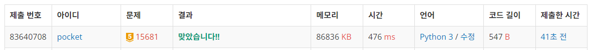

15681번: 트리와 쿼리 (골드 5)
| 시간 제한 | 메모리 제한 |
|:-----:|:------:|
|  1초   | 128MB  |

## 문제
간선에 가중치와 방향성이 없는 임의의 루트 있는 트리가 주어졌을 때, 아래의 쿼리에 답해보도록 하자.

정점 U를 루트로 하는 서브트리에 속한 정점의 수를 출력한다.
만약 이 문제를 해결하는 데에 어려움이 있다면, 하단의 힌트에 첨부한 문서를 참고하자.


## 문제 설명
```text
1. 숫자 리스트를 입력받는다.
2. 투포인터를 활용한다.
3. 더한 값의 절대값이 가장 작으면 저장한다.
4. 저장한 값이 0이면 break한다.
5. 가장 작지 않으면, 더한 값이 양수인 경우 rear를 1 감소, 그렇지 않으면 front를 1 증가 한다. 
```

## 입력
트리의 정점의 수 N과 루트의 번호 R, 쿼리의 수 Q가 주어진다. (2 ≤ N ≤ 105, 1 ≤ R ≤ N, 1 ≤ Q ≤ 105)

이어 N-1줄에 걸쳐, U V의 형태로 트리에 속한 간선의 정보가 주어진다. (1 ≤ U, V ≤ N, U ≠ V)

이는 U와 V를 양 끝점으로 하는 간선이 트리에 속함을 의미한다.

이어 Q줄에 걸쳐, 문제에 설명한 U가 하나씩 주어진다. (1 ≤ U ≤ N)

입력으로 주어지는 트리는 항상 올바른 트리임이 보장된다.
## 출력
Q줄에 걸쳐 각 쿼리의 답을 정수 하나로 출력한다.


## 예제 입력 1 
```text
9 5 3
1 3
4 3
5 4
5 6
6 7
2 3
9 6
6 8
5
4
8
```
## 예제 출력 1 
```text
9
4
1```

## 코드
```python
import sys
input = sys.stdin.readline

sys.setrecursionlimit(10**9)

N, R, Q = map(int, input().rstrip().split())
tree = {i: [] for i in range(1, N + 1)}

for _ in range(N - 1):
    u, v = map(int, input().rstrip().split())
    tree[u].append(v)
    tree[v].append(u)

cnt = {i: 0 for i in range(1, N + 1)}

def count_node(now):
    global cnt
    cnt[now] = 1
    for next in tree[now]:
        if not cnt[next]:
            cnt[now] += count_node(next)
    return cnt[now]

count_node(R)

for _ in range(Q):
    print(cnt[int(input().rstrip())])
```

## 채점 결과


## 스트릭
