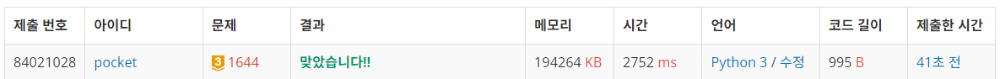
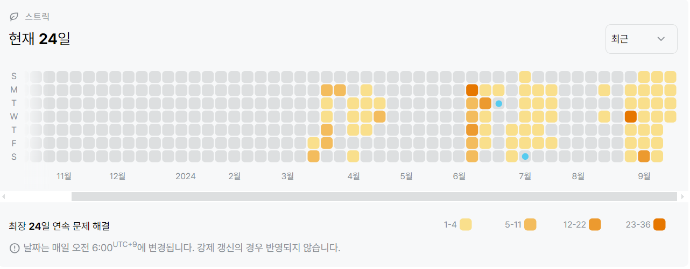

1644번: 소수의 연속합 (골드 3)
| 시간 제한 | 메모리 제한 |
|:-----:|:------:|
|  2초   | 128MB  |

## 문제
하나 이상의 연속된 소수의 합으로 나타낼 수 있는 자연수들이 있다. 몇 가지 자연수의 예를 들어 보면 다음과 같다.

3 : 3 (한 가지)
41 : 2+3+5+7+11+13 = 11+13+17 = 41 (세 가지)
53 : 5+7+11+13+17 = 53 (두 가지)
하지만 연속된 소수의 합으로 나타낼 수 없는 자연수들도 있는데, 20이 그 예이다. 7+13을 계산하면 20이 되기는 하나 7과 13이 연속이 아니기에 적합한 표현이 아니다. 또한 한 소수는 반드시 한 번만 덧셈에 사용될 수 있기 때문에, 3+5+5+7과 같은 표현도 적합하지 않다.

자연수가 주어졌을 때, 이 자연수를 연속된 소수의 합으로 나타낼 수 있는 경우의 수를 구하는 프로그램을 작성하시오.


## 문제 설명
```text
1. 에라토스테네스의 체 알고리즘과 누적합, 투포인터 알고리즘을 활용하여 해결한다.
2. N까지의 모든 소수를 구한다.
3. 누적합 리스트를 만든다.
4. 누적합 리스트를 투포인터로 순회하며 합이 N인 경우 1씩 카운트한다. 
```

## 입력
첫째 줄에 자연수 N이 주어진다. (1 ≤ N ≤ 4,000,000)


## 출력
첫째 줄에 자연수 N을 연속된 소수의 합으로 나타낼 수 있는 경우의 수를 출력한다.


## 예제 입력 1 
```text
20
```
## 예제 출력 1 
```text
0
```

## 예제 입력 2
```text
3
```

## 예제 출력 2
```text
1
```

## 예제 입력 3
```text
41
```

## 예제 출력 3
```text
3
```

## 예제 입력 4
```text
53
```
## 예제 출력 4
```text
2
```

## 코드
```python
import sys
input = sys.stdin.readline

N = int(input().rstrip())


def get_primes(n):
    nums = [i for i in range(n + 1)]
    nums[1] = 0
    for i in range(2, n + 1):
        for j in range(i * i, n + 1, i):
            nums[j] = 0

    return list(filter(lambda x: x != 0, nums))


def get_prefix_sum(nums):
    prefix_sum = [0 for _ in range(len(nums) + 1)]
    for i in range(1, len(nums) + 1):
        prefix_sum[i] = prefix_sum[i - 1] + nums[i - 1]
    return prefix_sum


def sol(n):
    if n == 1:
        return 0
    primes = get_primes(n)
    prefix_sum = get_prefix_sum(primes)

    m = len(prefix_sum)
    ans = 0
    front, rear = 0, 1

    while True:
        _sum = prefix_sum[rear] - prefix_sum[front]
        if _sum == n:
            ans += 1
            rear += 1
            if rear == m:
                break
        elif _sum < n:
            rear += 1
            if rear == m:
                break
        else:
            front += 1

    return ans


print(sol(N))

```

## 채점 결과


## 스트릭
